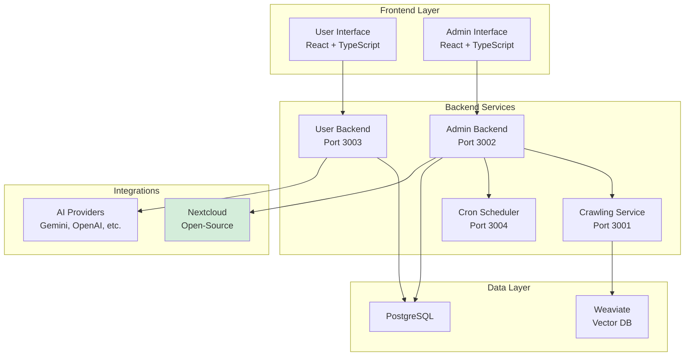
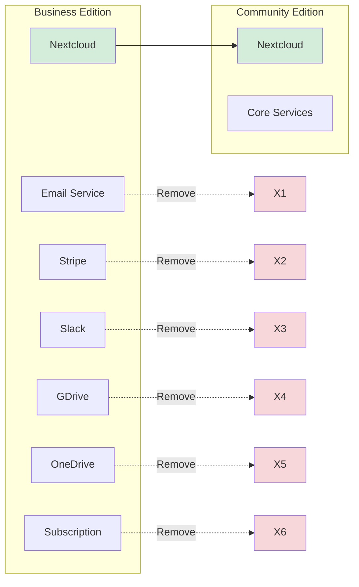
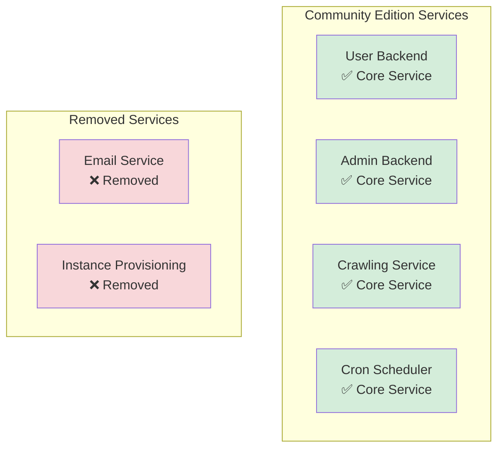
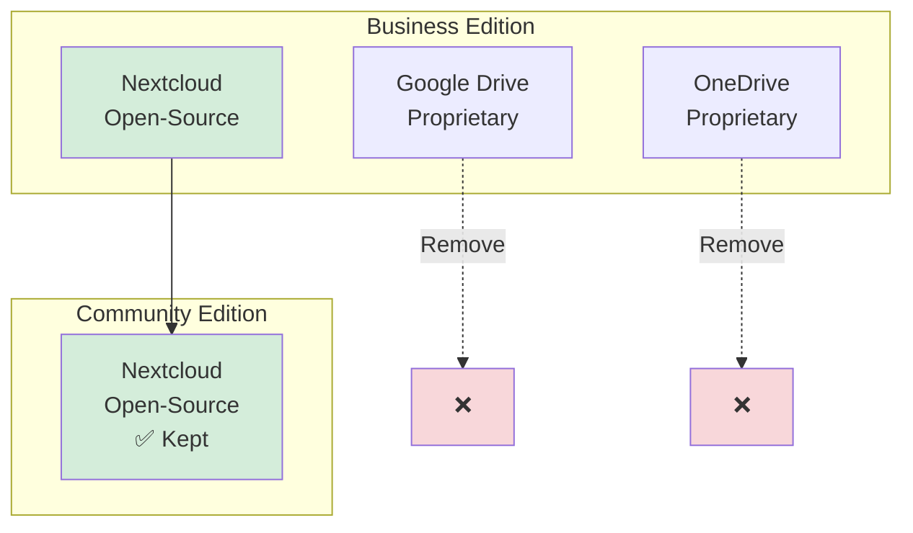

# Architecture Overview

**Purpose:** Understand the Community Edition architecture

---

## System Architecture

---

## Component Comparison

### Business vs Community Edition

---

## Service Architecture

### Services in Community Edition

---

## Integration Architecture

### Cloud Provider Integration

---

**Last Updated:** 2026-01-05
