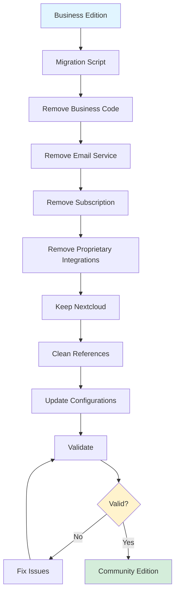

# Migration Overview

**Purpose:** Understand how improvements are migrated from Business Edition to Community Edition

---

## What is Migration?

Migration is the process of taking improvements from the Business Edition and applying them to the Community Edition while ensuring:

- ✅ **NO business traces** remain
- ✅ **NO proprietary code** is included
- ✅ **Clean, contributor-friendly** codebase

---

## Migration Process Flow

---

## What Gets Migrated

### ✅ Core Infrastructure
- Shared code packages
- Database connection management
- Resilience library
- 2FA implementation
- Bug fixes and optimizations

### ✅ Code Quality
- TypeScript improvements
- Logging standardization
- Type definitions

### ✅ UI/UX
- Component library
- Responsive design
- Accessibility

---

## What Gets Removed

### ❌ Business-Specific
- Email service (complete removal)
- Subscription system (complete removal)
- Stripe integration (complete removal)
- Business website (complete removal)
- Enterprise features (complete removal)

### ❌ Proprietary Integrations
- Slack (removed)
- Teams (removed)
- Google Drive (removed)
- OneDrive (removed)

### ✅ Open-Source Preserved
- Nextcloud (kept - open-source)

---

## Migration Frequency

**On-demand only** - Migration is triggered manually when improvements are ready.

---

## Next Steps

- [Migration Process](process.md) - Step-by-step guide
- [Validation](validation.md) - How to validate migration
- [Troubleshooting](troubleshooting.md) - Common issues and solutions

---

**Last Updated:** 2026-01-05
