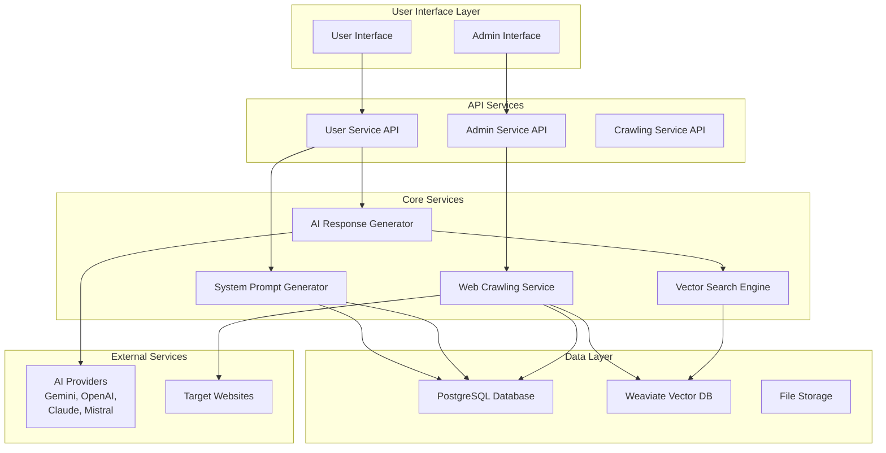
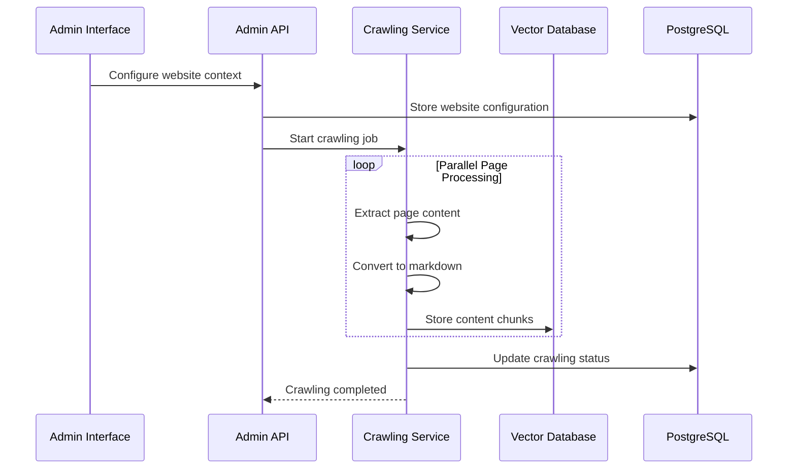
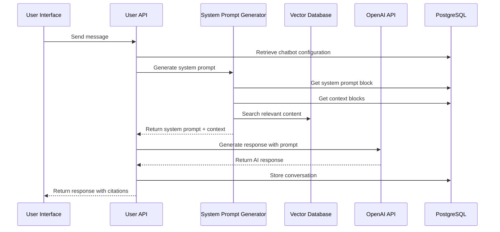
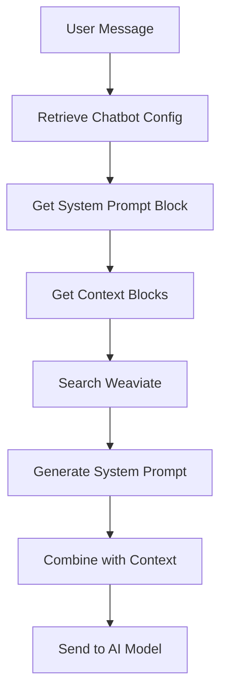
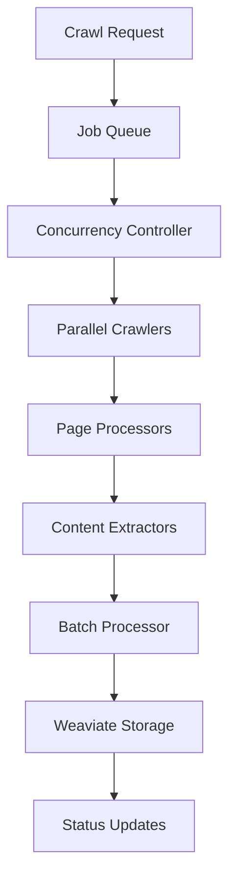
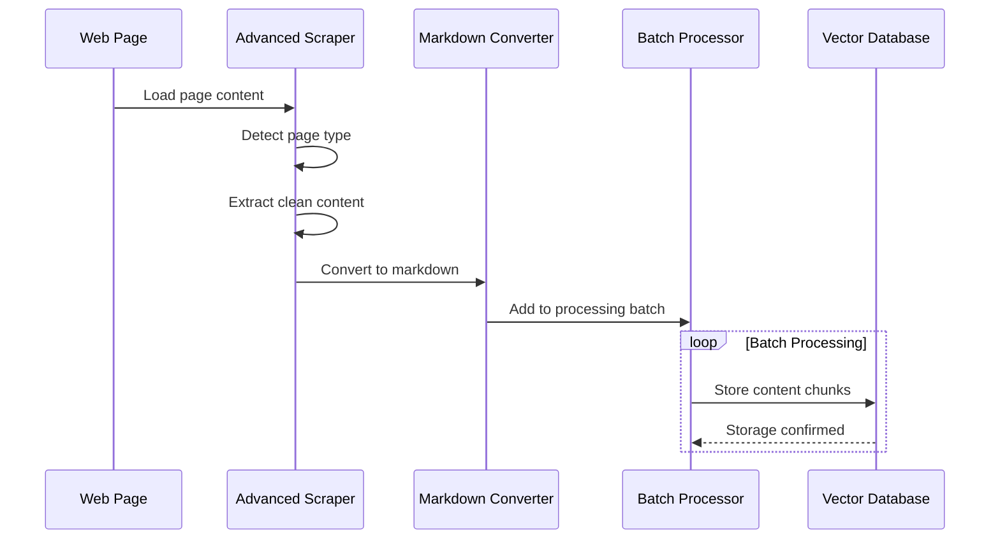
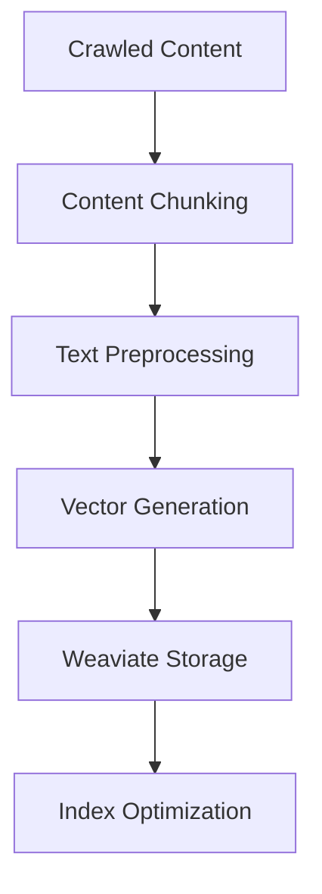
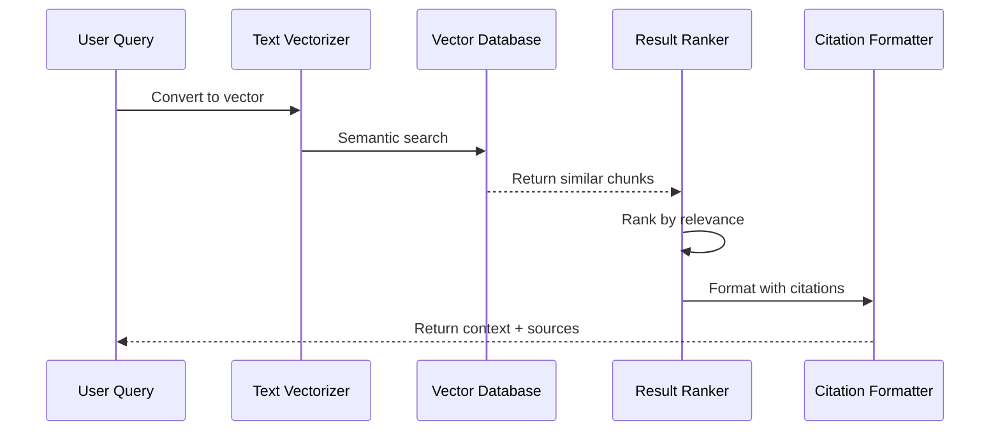
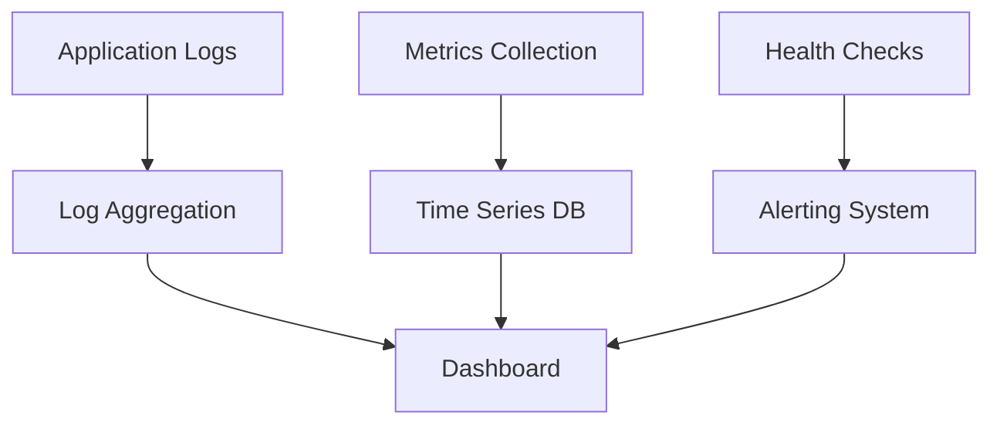

# AI Pipeline Architecture

This document provides a comprehensive overview of how the CitadelAI system integrates system prompt generation and web crawling to create intelligent, context-aware AI responses.

## System Overview

The CitadelAI platform combines multiple services to deliver personalized AI experiences:

- **System Prompt Generation**: Creates dynamic, context-aware prompts for AI models
- **Web Crawling**: Harvests and indexes web content for knowledge retrieval
- **Vector Search**: Enables semantic search across crawled content
- **AI Response Generation**: Produces intelligent responses with proper citations

## High-Level Architecture



## Data Flow Architecture

### 1. Content Ingestion Flow



### 2. AI Response Generation Flow



## System Prompt Generation Pipeline

### Input Sources

1. **User Configuration**
   - Bot name and personality
   - Company information
   - Behavior type selection
   - Custom instructions

2. **Knowledge Sources**
   - Website contexts (crawled content)
   - Document contexts (uploaded files)
   - Real-time context (from Weaviate)

3. **Dynamic Context**
   - User's current message
   - Conversation history
   - Relevant content chunks

### Processing Steps



### System Prompt Structure

```
1. Identity Definition
   ├── Bot name and role
   ├── Company context
   └── Behavior description

2. Knowledge Sources
   ├── Website references
   ├── Document references
   └── Usage instructions

3. Additional Instructions
   ├── Custom behaviors
   ├── Response guidelines
   └── Citation requirements

4. Dynamic Context
   ├── Retrieved content
   ├── Source metadata
   └── Contextual information
```

## Web Crawling Pipeline

### Crawling Architecture



### Parallelization Levels

#### Level 1: Job Parallelization
- **Concurrent Jobs**: Up to 4 websites simultaneously
- **Job Isolation**: Independent resource allocation
- **Dynamic Scaling**: Automatic capacity management

#### Level 2: Page Parallelization
- **Concurrent Pages**: Up to 5 pages per website
- **Resource Sharing**: Efficient browser instance usage
- **Load Balancing**: Optimal page distribution

#### Level 3: Content Processing
- **Batch Processing**: Groups of 5 content items
- **Async Storage**: Non-blocking Weaviate operations
- **Queue Management**: Memory-efficient processing

### Content Processing Pipeline



## Vector Search Integration

### Content Indexing



### Search Process



## Service Integration Patterns

### 1. Synchronous Integration
- **System Prompt Generation**: Immediate response required
- **Context Retrieval**: Real-time search for relevant content
- **Response Generation**: Direct AI model interaction

### 2. Asynchronous Integration
- **Web Crawling**: Background processing with status updates
- **Content Indexing**: Batch processing for efficiency
- **Status Monitoring**: Real-time progress tracking

### 3. Event-Driven Integration
- **Crawling Completion**: Triggers content availability
- **Status Updates**: Real-time progress notifications
- **Error Handling**: Automatic retry and fallback

## Performance Characteristics

### System Prompt Generation
- **Latency**: < 100ms for prompt generation
- **Throughput**: 100+ requests/second
- **Cache Hit Rate**: 80%+ for repeated configurations

### Web Crawling
- **Concurrency**: 4 websites × 5 pages = 20 concurrent operations
- **Throughput**: 50+ pages/minute per website
- **Storage**: 4000-character chunks in Weaviate

### Vector Search
- **Query Latency**: < 200ms for semantic search
- **Index Size**: Scales to millions of content chunks
- **Relevance**: 90%+ accuracy for relevant content

## Error Handling and Resilience

### System Prompt Generation
- **Fallback Prompts**: Default prompts for missing configuration
- **Context Recovery**: Graceful handling of missing context
- **Validation**: Input sanitization and validation

### Web Crawling
- **Retry Logic**: Exponential backoff for failed operations
- **Graceful Degradation**: Partial success handling
- **Resource Cleanup**: Automatic cleanup of browser instances

### Vector Search
- **Query Fallback**: Alternative search strategies
- **Index Recovery**: Automatic index rebuilding
- **Timeout Handling**: Graceful timeout management

## Monitoring and Observability

### Key Metrics

#### System Prompt Generation
- **Generation Time**: Time to create system prompts
- **Context Retrieval Time**: Weaviate query performance
- **Cache Hit Rate**: Configuration caching effectiveness
- **Error Rate**: Failed prompt generations

#### Web Crawling
- **Active Jobs**: Number of concurrent crawl jobs
- **Pages Processed**: Total pages crawled per job
- **Processing Time**: Average time per page
- **Success Rate**: Percentage of successful operations

#### Vector Search
- **Query Latency**: Time to retrieve relevant content
- **Index Size**: Total content chunks indexed
- **Relevance Score**: Quality of search results
- **Storage Usage**: Weaviate storage consumption

### Monitoring Tools



## Security Considerations

### Data Protection
- **Content Sanitization**: Remove sensitive information from crawled content
- **Access Control**: User-based access to chatbot configurations
- **Encryption**: Encrypted storage and transmission

### Privacy Compliance
- **Data Retention**: Configurable content retention policies
- **User Consent**: Clear consent for data collection
- **Right to Deletion**: User data removal capabilities

## Scalability Patterns

### Horizontal Scaling
- **Service Replication**: Multiple instances of each service
- **Load Balancing**: Distribute requests across instances
- **Database Sharding**: Partition data across multiple databases

### Vertical Scaling
- **Resource Allocation**: Increase CPU/memory for services
- **Concurrency Tuning**: Adjust parallel processing limits
- **Cache Sizing**: Increase cache capacity for better performance

## Future Architecture Evolution

### Planned Enhancements
1. **Microservices Architecture**: Further service decomposition
2. **Event Sourcing**: Event-driven architecture for better scalability
3. **Performance Optimization**: Query optimization and caching strategies
4. **GraphQL API**: More flexible API for frontend integration

### Integration Improvements
1. **Real-time Updates**: WebSocket-based status updates
2. **Content Versioning**: Track content changes over time
3. **Advanced Analytics**: Detailed usage and performance analytics
4. **Multi-tenant Architecture**: Better isolation and resource management