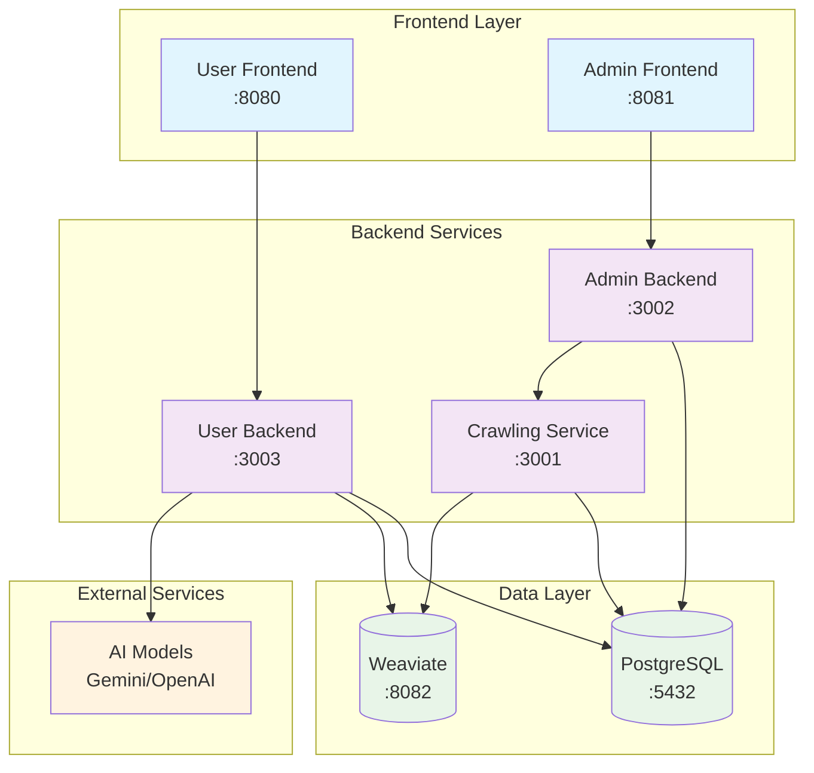
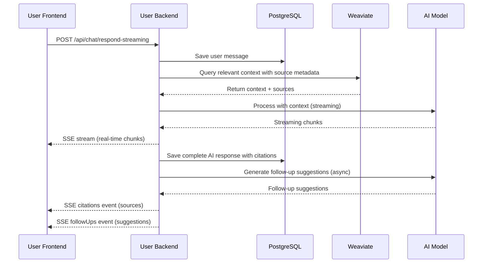
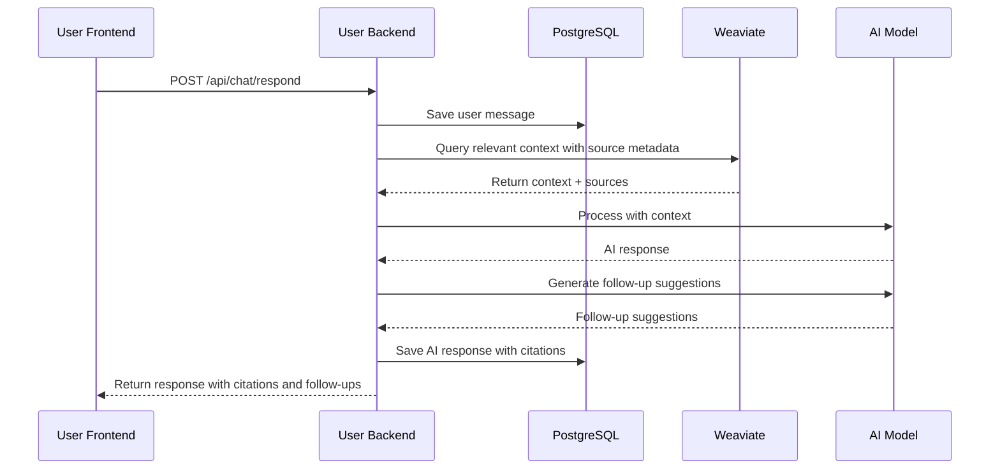
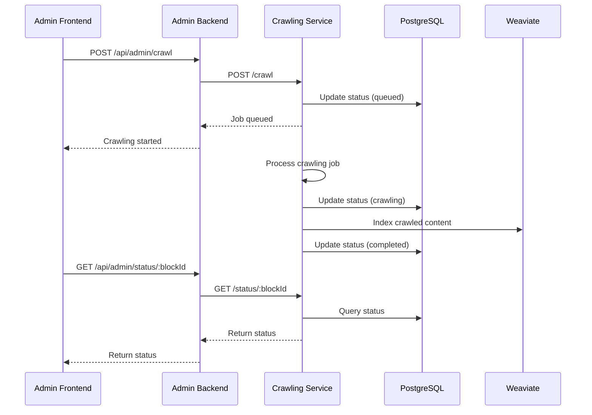
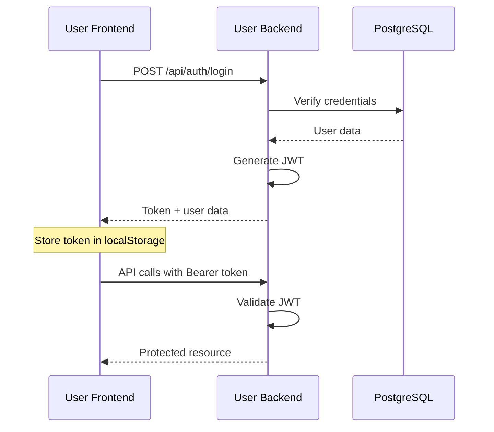
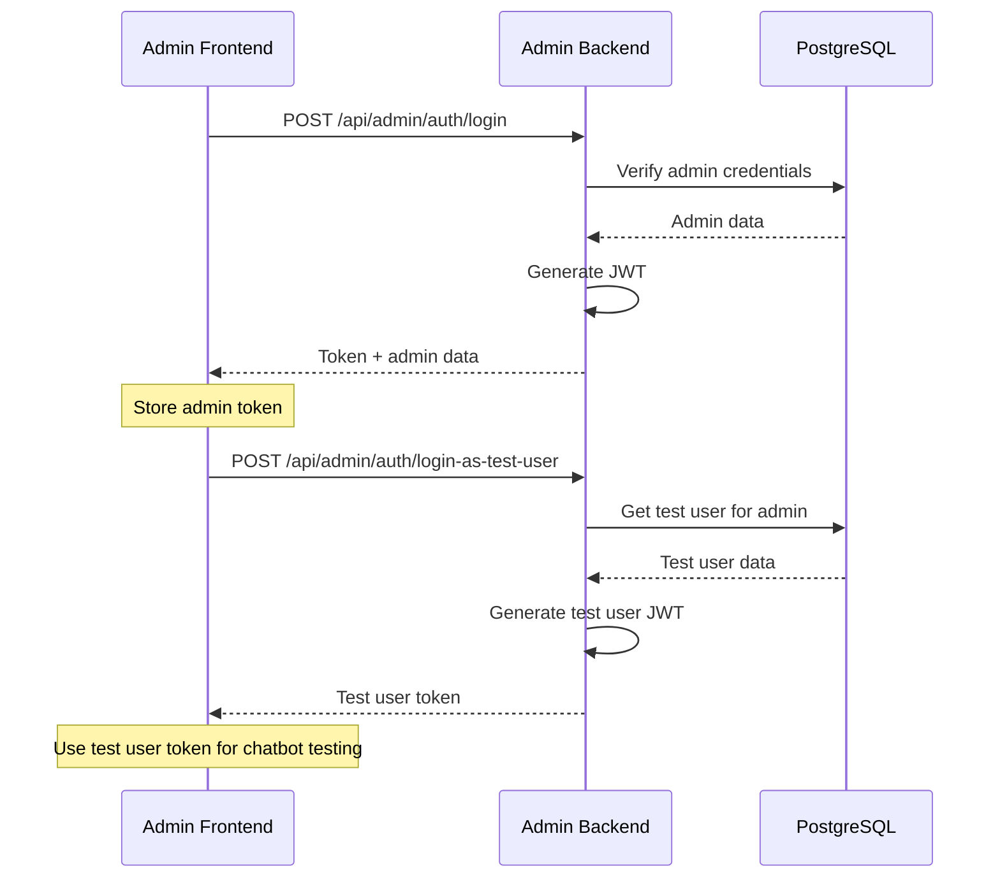

# CitadelAI API Routes Documentation

This document provides comprehensive documentation of all API routes, container interactions, and data flow within the CitadelAI platform.

## Table of Contents

1. [Architecture Overview](#architecture-overview)
2. [Container Services](#container-services)
3. [API Endpoints by Service](#api-endpoints-by-service)
4. [Service Interactions](#service-interactions)
5. [Data Flow Diagrams](#data-flow-diagrams)
6. [Authentication Flow](#authentication-flow)
7. [Error Handling](#error-handling)

## Architecture Overview

CitadelAI is a platform with the following service architecture:

- **Frontend Services**: User Interface (port 8080) and Admin Interface (port 8081)
- **Backend Services**: User Backend (port 3003), Admin Backend (port 3002), Crawling Service (port 3001)
- **Data Services**: PostgreSQL Database (port 5432), Weaviate Vector Database (port 8082)
- **Network**: All services communicate through the `citadel-net` Docker network

## Container Services

### Service Ports and Responsibilities

| Service | Port | Internal Port | Purpose |
|--------|------|---------------|---------|
| `user-frontend` | 8080 | 80 | User-facing React application |
| `admin-frontend` | 8081 | 80 | Admin-facing React application |
| `user-backend` | 3003 | 3003 | User API and chat functionality |
| `admin-backend` | 3002 | 3002 | Admin API and chatbot management |
| `crawling-service` | 3001 | 3001 | Website crawling and content ingestion |
| `db` | 5432 | 5432 | PostgreSQL database |
| `weaviate` | 8082 | 8080 | Vector database for AI features |

### Environment Variables

- **Database**: `DATABASE_URL=postgresql://citadel_user:citadel_pass@db:5432/citadel_db`
- **Crawling Service**: `CRAWLING_SERVICE_URL=http://crawling-service:3001`
- **Weaviate**: `OPENAI_API_KEY` for vectorization

## API Endpoints by Service

### User Backend Service (Port 3003)

#### Authentication Routes (`/api/auth`)

| Method | Endpoint | Description | Auth Required |
|--------|----------|-------------|---------------|
| POST | `/api/auth/register` | Register new user | No |
| POST | `/api/auth/login` | Login user | No |
| POST | `/api/auth/logout` | Logout user | Yes |
| GET | `/api/auth/me` | Get current user info | Yes |

**Request Examples:**
```json
// POST /api/auth/register
{
  "email": "user@example.com",
  "password": "password123",
  "name": "John Doe"
}

// POST /api/auth/login
{
  "email": "user@example.com",
  "password": "password123"
}
```

#### Chat Routes (`/api/chat`)

| Method | Endpoint | Description | Auth Required |
|--------|----------|-------------|---------------|
| POST | `/api/chat/respond` | Send message and get AI response | Yes |
| POST | `/api/chat/respond-streaming` | Real-time streaming response using SSE | Yes |
| GET | `/api/chat/history` | Get chat history for session | Yes |
| GET | `/api/chat` | Get all chat sessions | Yes |
| POST | `/api/chat` | Create new chat session | Yes |
| POST | `/api/chat/:id/title` | Generate title for chat session | Yes |
| DELETE | `/api/chat/:id` | Delete chat session | Yes |

**Request Examples:**
```json
// POST /api/chat/respond
{
  "message": "Hello, how can you help me?",
  "sessionId": "session-uuid",
  "chatbotId": "chatbot-uuid"
}

// POST /api/chat/respond-streaming
{
  "message": "Hello, how can you help me?",
  "chatSessionId": "session-uuid"
}

// GET /api/chat/history?sessionId=session-uuid
```

**Streaming Response Format:**
The streaming endpoint returns Server-Sent Events (SSE) with the following event types:
- `metadata`: Session information
- `chunk`: Text chunks for progressive display
- `complete`: Final response completion
- `citations`: Source citations for the response
- `followUps`: AI-generated follow-up suggestions
- `error`: Error handling

**Response Format with Sources and Follow-ups:**
```json
// Regular response
{
  "message": "AI response content with sources...",
  "followUps": [
    {
      "id": "1",
      "text": "Tell me more about this topic",
      "icon": "MessageSquare"
    }
  ],
  "citations": "\n\n**Sources:**\n1. [example.com](https://example.com) (pages: 2)\n2. User Manual.pdf (parts: 1, 3)",
  "chatSessionId": "session-uuid"
}

// Streaming response events
data: {"type": "metadata", "chatSessionId": "session-uuid"}
data: {"type": "chunk", "content": "AI response text..."}
data: {"type": "complete", "fullResponse": "Complete AI response"}
data: {"type": "citations", "citations": "**Sources:**\n1. [example.com](https://example.com)"}
data: {"type": "followUps", "followUps": [{"id": "1", "text": "Follow-up question"}]}
```

#### Chatbot Routes (`/api/chatbots`)

| Method | Endpoint | Description | Auth Required |
|--------|----------|-------------|---------------|
| GET | `/api/chatbots` | Get available chatbots for user | Yes |
| GET | `/api/chatbots/:id` | Get specific chatbot details | Yes |
| POST | `/api/chatbots/:chatbotId/set-default` | Set default chatbot for user | Yes |

### Admin Backend Service (Port 3002)

#### Admin Authentication Routes (`/api/admin/auth`)

| Method | Endpoint | Description | Auth Required |
|--------|----------|-------------|---------------|
| POST | `/api/admin/auth/register` | Register new admin user | No |
| POST | `/api/admin/auth/login` | Login admin user | No |
| POST | `/api/admin/auth/login-as-test-user` | Get test user token | Yes |
| GET | `/api/admin/me` | Get current admin info | Yes |

#### Admin Profile Management Routes (`/api/admin`)

| Method | Endpoint | Description | Auth Required |
|--------|----------|-------------|---------------|
| PUT | `/api/admin/profile` | Update admin profile (name, email, company) | Yes |
| PUT | `/api/admin/change-password` | Change admin password | Yes |
| DELETE | `/api/admin/delete-account` | Delete admin account and all associated data | Yes |

**Request Examples:**
```json
// POST /api/admin/auth/register
{
  "email": "admin@example.com",
  "password": "admin123",
  "role": "ADMIN",
  "company": "Example Corp"
}

// POST /api/admin/auth/login
{
  "email": "admin@example.com",
  "password": "admin123"
}

// PUT /api/admin/profile
{
  "name": "John Doe",
  "email": "john.doe@example.com",
  "company": "Acme Corporation"
}

// PUT /api/admin/change-password
{
  "currentPassword": "oldpassword123",
  "newPassword": "newpassword456"
}

// DELETE /api/admin/delete-account
// No request body required - uses JWT token for authentication
```

**Response Examples:**
```json
// GET /api/admin/me
{
  "id": "admin-uuid",
  "email": "admin@example.com",
  "name": "John Doe",
  "role": "ADMIN",
  "company": "Acme Corporation",
  "createdAt": "2025-01-01T00:00:00.000Z",
  "updatedAt": "2025-01-01T00:00:00.000Z"
}

// PUT /api/admin/profile (success)
{
  "id": "admin-uuid",
  "email": "john.doe@example.com",
  "name": "John Doe",
  "role": "ADMIN",
  "company": "Acme Corporation",
  "createdAt": "2025-01-01T00:00:00.000Z",
  "updatedAt": "2025-01-01T12:00:00.000Z"
}

// DELETE /api/admin/delete-account (success)
{
  "message": "Account deleted successfully"
}
```

**Error Responses:**
```json
// PUT /api/admin/profile (email already taken)
{
  "error": "Email is already taken by another account"
}

// PUT /api/admin/profile (validation error)
{
  "error": "Name and email are required"
}

// PUT /api/admin/change-password (incorrect current password)
{
  "error": "Current password is incorrect"
}

// PUT /api/admin/change-password (password too short)
{
  "error": "New password must be at least 6 characters long"
}

// DELETE /api/admin/delete-account (foreign key constraint)
{
  "error": "Error deleting account"
}
```

#### Dashboard Routes (`/api/admin/dashboard`)

| Method | Endpoint | Description | Auth Required |
|--------|----------|-------------|---------------|
| GET | `/api/admin/dashboard/stats` | Get platform statistics | Yes (ADMIN role) |

**Response Example:**
```json
{
  "totalChatbots": 15,
  "totalConversations": 2513,
  "activeUsers": 892
}
```

#### Chatbot Management Routes (`/api/admin/chatbots`)

| Method | Endpoint | Description | Auth Required |
|--------|----------|-------------|---------------|
| POST | `/api/admin/chatbots` | Create new chatbot | Yes |
| GET | `/api/admin/chatbots` | List admin's chatbots | Yes |
| GET | `/api/admin/chatbots/:id` | Get chatbot configuration | Yes |
| PUT | `/api/admin/chatbots/:id` | Update chatbot configuration | Yes |
| DELETE | `/api/admin/chatbots/:id` | Delete chatbot | Yes |
| DELETE | `/api/admin/chatbots/:chatbotId/blocks/:blockId` | Delete specific block | Yes |

**Request Examples:**
```json
// POST /api/admin/chatbots
{
  "name": "Customer Support Bot"
}

// PUT /api/admin/chatbots/:id
{
  "name": "Updated Bot Name",
  "status": "ACTIVE",
  "blocks": [...],
  "connections": [...],
  "websiteContexts": [...]
}
```

#### User Access Management Routes (`/api/admin/chatbots/:id/users`)

| Method | Endpoint | Description | Auth Required |
|--------|----------|-------------|---------------|
| GET | `/api/admin/chatbots/:id/users` | Get users with access | Yes |
| POST | `/api/admin/chatbots/:id/users` | Grant user access | Yes |
| DELETE | `/api/admin/chatbots/:id/users/:accessId` | Remove user access | Yes |

#### Crawling Service Proxy Routes (`/api/admin`)

| Method | Endpoint | Description | Auth Required |
|--------|----------|-------------|---------------|
| POST | `/api/admin/crawl` | Start crawling job | Yes |
| GET | `/api/admin/status/:blockId` | Get crawling status | Yes |
| POST | `/api/admin/stop` | Stop crawling job | Yes |

**Request Examples:**
```json
// POST /api/admin/crawl
{
  "url": "https://example.com",
  "chatbotId": "chatbot-uuid",
  "blockId": "block-uuid",
  "recursive": true,
  "maxDepth": 3
}

// POST /api/admin/stop
{
  "chatbotId": "chatbot-uuid",
  "blockId": "block-uuid"
}
```

### Crawling Service (Port 3001)

#### Direct Crawling Routes

| Method | Endpoint | Description | Auth Required |
|--------|----------|-------------|---------------|
| POST | `/crawl` | Start crawling job | No (internal) |
| GET | `/status/:blockId` | Get crawling status | No (internal) |
| POST | `/stop` | Stop crawling job | No (internal) |

**Request Examples:**
```json
// POST /crawl
{
  "url": "https://example.com",
  "chatbotId": "chatbot-uuid",
  "blockId": "block-uuid",
  "recursive": true,
  "maxDepth": 3
}

// Response
{
  "message": "Crawling job added to the queue"
}
```

## Service Interactions

### Data Flow Patterns

1. **User Authentication Flow**:
   ```
   User Frontend → User Backend → PostgreSQL
   ```

2. **Chat Interaction Flow**:
   ```
   User Frontend → User Backend → PostgreSQL → Weaviate → AI Model
   ```

3. **Real-time Streaming Flow**:
   ```
   User Frontend → User Backend (SSE) → Gemini API (Stream) → Progressive UI Updates
   ```

4. **Admin Chatbot Creation**:
   ```
   Admin Frontend → Admin Backend → PostgreSQL
   ```

5. **Crawling Workflow**:
   ```
   Admin Frontend → Admin Backend → Crawling Service → PostgreSQL → Weaviate
   ```

### Inter-Service Communication

| From Service | To Service | Purpose | Method |
|--------------|------------|---------|---------|
| User Frontend | User Backend | API calls | HTTP |
| User Frontend | User Backend | Real-time streaming | SSE |
| Admin Frontend | Admin Backend | API calls | HTTP |
| Admin Backend | Crawling Service | Trigger crawling | HTTP |
| User Backend | PostgreSQL | Data persistence | SQL |
| Admin Backend | PostgreSQL | Data persistence | SQL |
| Crawling Service | PostgreSQL | Status updates | SQL |
| User Backend | Weaviate | Vector operations | HTTP |
| Crawling Service | Weaviate | Content indexing | HTTP |
| User Backend | Gemini API | AI processing | HTTP/Stream |

## Data Flow Diagrams

### Complete System Architecture



### Chat Flow Sequence



### Traditional Chat Flow (Fallback)



### Admin Crawling Flow



## Authentication Flow

### User Authentication



### Admin Authentication



## Error Handling

### HTTP Status Codes

| Status Code | Description | Usage |
|-------------|-------------|-------|
| 200 | OK | Successful GET/PUT requests |
| 201 | Created | Successful POST requests |
| 204 | No Content | Successful DELETE requests |
| 400 | Bad Request | Missing required fields |
| 401 | Unauthorized | Invalid/missing authentication |
| 403 | Forbidden | Insufficient permissions |
| 404 | Not Found | Resource doesn't exist |
| 409 | Conflict | Duplicate resource (email already exists) |
| 500 | Internal Server Error | Server-side errors |

### Error Response Format

```json
{
  "error": "Error message description"
}
```

### Common Error Scenarios

1. **Authentication Errors**:
   - Missing JWT token: `401 Unauthorized`
   - Invalid JWT token: `403 Forbidden`
   - Expired token: `401 Unauthorized` (triggers automatic logout and redirect)

2. **Validation Errors**:
   - Missing required fields: `400 Bad Request`

### Session Management and Automatic Logout

The admin frontend implements automatic session expiry handling:

#### Automatic Session Expiry Detection
- **401 Unauthorized responses** are automatically detected by the centralized API client
- **Immediate logout**: User authentication state is cleared from localStorage and context
- **Automatic redirect**: Users are redirected to the login page (`/login`)
- **Error handling**: Clear error message "Session expired. Please log in again."

#### Implementation Details
- **Centralized API Client**: All API calls use a unified client that intercepts 401 responses
- **Global Logout Function**: The AuthContext registers a global logout function with the API client
- **Error Handler Integration**: The useErrorHandler hook also catches 401 errors for additional safety
- **Comprehensive Coverage**: All API endpoints benefit from automatic session expiry handling

#### User Experience
- **Seamless**: Users are automatically redirected without manual intervention
- **Secure**: Authentication state is properly cleared before redirect
- **Consistent**: Same behavior across all admin interface pages and components
- **User-Friendly**: Clear messaging about session expiry

3. **Validation Errors (continued)**:
   - Invalid email format: `400 Bad Request`
   - Duplicate email: `409 Conflict`

4. **Resource Errors**:
   - Chatbot not found: `404 Not Found`
   - User not found: `404 Not Found`
   - Access denied: `403 Forbidden`

4. **Service Errors**:
   - Database connection issues: `500 Internal Server Error`
   - External service failures: `500 Internal Server Error`
   - Crawling service unavailable: `500 Internal Server Error`

### Document Processing Routes (`/api/admin`)

#### Document Upload and Processing

| Method | Endpoint | Description | Auth Required |
|--------|----------|-------------|---------------|
| POST | `/process-document` | Upload and process PDF documents | Yes (Admin) |

**Request Body:**
- `file`: PDF file (multipart/form-data)
- `chatbotId`: String - Target chatbot ID
- `blockId`: String - Document context block ID

**Response:**
```json
{
  "markdown": "Converted markdown content...",
  "vectors": [
    {
      "id": "weaviate-vector-id",
      "content": "Document chunk content",
      "chunkIndex": 0,
      "totalChunks": 5
    }
  ],
  "fileName": "document.pdf",
  "fileSize": 1024000
}
```

**Error Responses:**
- File too large: `413 Request Entity Too Large`
- Invalid file type: `400 Bad Request`
- PDF parsing error: `400 Bad Request`
- Vectorization error: `500 Internal Server Error`

**Processing Pipeline:**
1. File validation (PDF, max 10MB)
2. PDF text extraction using pdf-parse
3. Markdown conversion
4. Content chunking (1000 char chunks)
5. Weaviate vectorization
6. Response with metadata

## Security Considerations

### Authentication
- JWT tokens with 1-hour expiration
- Password hashing with bcrypt
- Role-based access control (ADMIN vs regular users)

### Network Security
- Services communicate within Docker network
- Database credentials passed via environment variables
- CORS enabled for frontend-backend communication

### Data Protection
- Sensitive data (passwords) excluded from API responses
- Input validation on all endpoints
- SQL injection prevention via Prisma ORM

## Monitoring and Logging

### Request Logging
All services log incoming requests with timestamp and method:
```
[2025-01-15T10:30:00.000Z] POST /api/chat/respond
```

### Error Logging
Services log detailed error information for debugging:
```
[CRAWL QUEUE ERROR] - Failed to add job for blockId: block-uuid
```

### Health Checks
- PostgreSQL: `pg_isready` check every 5 seconds
- Services: HTTP endpoint monitoring
- Docker: Container health status

This documentation provides a comprehensive overview of all API routes, service interactions, and data flows within the CitadelAI platform. For specific implementation details, refer to the individual service documentation files.