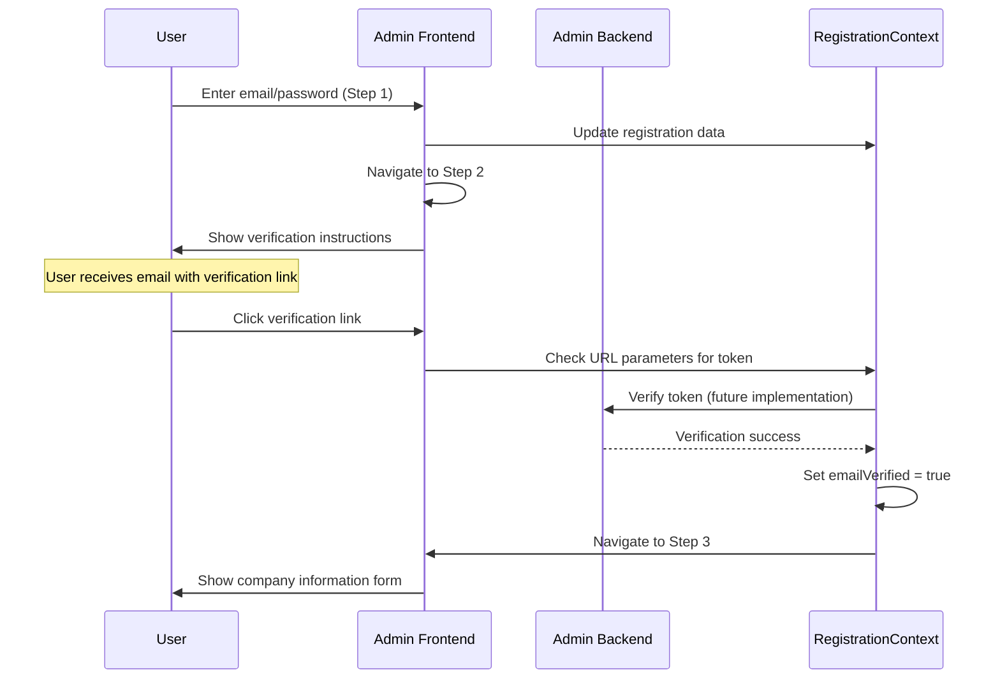
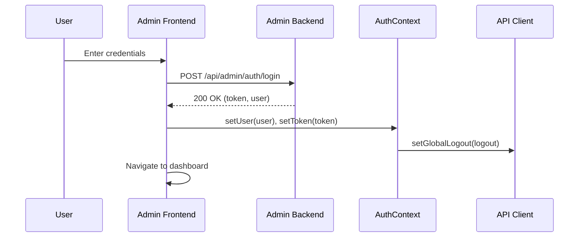
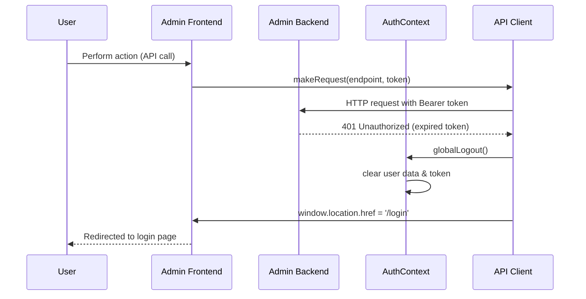

# Frontend Authentication and Session Management

This document describes the authentication and session management implementation in the CitadelAI admin frontend, including the multi-step registration flow with email verification.

## Overview

The admin frontend implements a comprehensive authentication system with:
- Multi-step registration flow with email verification
- Automatic session expiry handling
- Seamless user experience with state persistence
- Real-time email verification via URL parameters

## Architecture

### Components

1. **AuthContext** (`/src/contexts/AuthContext.tsx`)
   - Manages user authentication state
   - Provides login, logout, and user data management
   - Registers global logout function with API client

2. **RegistrationContext** (`/src/contexts/RegistrationContext.tsx`)
   - Manages multi-step registration state
   - Handles email verification status
   - Provides step navigation and validation
   - Persists registration data in localStorage

3. **API Client** (`/src/lib/apiClient.ts`)
   - Centralized HTTP client for all API calls
   - Intercepts 401 Unauthorized responses
   - Automatically handles session expiry

4. **Error Handler** (`/src/hooks/useErrorHandler.ts`)
   - Additional error handling for 401/403 responses
   - Provides fallback error handling for components

## Multi-Step Registration Flow

### Registration Steps

The registration process consists of 5 steps with email verification:

1. **Step 1: Account Setup**
   - Email address and password collection
   - Password confirmation and validation
   - Basic form validation

2. **Step 2: Email Verification**
   - Displays verification instructions
   - Handles verification via URL parameters
   - Shows verification status and success states
   - Prevents progression until email is verified

3. **Step 3: Company Information**
   - Company name collection
   - Organization identification setup

4. **Step 4: Personal Information**
   - Full name collection
   - Personal profile setup

5. **Step 5: First Chatbot Creation**
   - Chatbot name and description
   - Automatic chatbot creation with backend
   - Direct redirect to chatbot builder

### Email Verification Process



### State Management

The RegistrationContext provides:

- **Persistent State**: All form data saved to localStorage
- **Step Navigation**: Forward/backward navigation with validation
- **Email Verification**: Token handling and verification status
- **Navigation Restrictions**: Prevents going back after email verification
- **Progress Tracking**: Visual progress indicator across steps

### URL Parameter Handling

Email verification works via URL parameters:

```
/register?token=verification-token-123
```

When a user clicks a verification link:
1. RegistrationContext detects the token parameter
2. Validates the token (currently simulated)
3. Sets `emailVerified = true`
4. Automatically advances to Step 3
5. Prevents backward navigation to Steps 1-2

## Session Management Flow

### Login Process



### Session Expiry Handling



## Implementation Details

### API Client Features

The centralized API client (`apiClient.ts`) provides:

- **Automatic 401 Detection**: Intercepts all HTTP responses
- **Global Logout Integration**: Calls the registered logout function
- **Automatic Redirect**: Uses `window.location.href` for reliable redirection
- **Error Propagation**: Throws clear error messages for debugging

### AuthContext Integration

The AuthContext provides:

- **Global Logout Function**: Registers with the API client on mount
- **State Management**: Manages user data and authentication tokens
- **localStorage Integration**: Persists authentication state across sessions
- **React Context**: Provides authentication state to all components

### Error Handler Integration

The useErrorHandler hook provides:

- **401 Error Catching**: Additional safety net for 401 responses
- **403 Error Handling**: Handles forbidden access scenarios
- **Navigation Logic**: Determines appropriate redirect based on current route
- **Component Integration**: Easy integration with React components

## Security Features

### Automatic Session Cleanup

When a 401 response is detected:

1. **Immediate Logout**: User data and tokens are cleared from memory
2. **localStorage Cleanup**: Authentication data is removed from browser storage
3. **Context Reset**: React context is updated to reflect logged-out state
4. **Redirect**: User is sent to login page

### Token Management

- **JWT Tokens**: All API calls include Bearer tokens in Authorization headers
- **Automatic Inclusion**: Tokens are automatically added to authenticated requests
- **Secure Storage**: Tokens are stored in localStorage (consider httpOnly cookies for production)

## User Experience

### Seamless Session Expiry

- **No Manual Intervention**: Users don't need to manually refresh or re-login
- **Clear Messaging**: "Session expired" error message is displayed
- **Immediate Feedback**: Users are redirected as soon as session expires
- **Consistent Behavior**: Same experience across all pages and components

### Error Handling

- **Graceful Degradation**: Components handle authentication errors gracefully
- **User-Friendly Messages**: Clear, actionable error messages
- **Automatic Recovery**: Users can immediately re-authenticate after redirect

## Usage in Components

### Basic API Call

```typescript
import { useAuth } from '@/contexts/AuthContext';
import { getChatbots } from '@/lib/api';

const MyComponent = () => {
  const { token } = useAuth();
  
  const fetchData = async () => {
    try {
      const data = await getChatbots(token);
      // Handle success
    } catch (error) {
      // Error is automatically handled by API client
      // User will be redirected to login if 401
    }
  };
};
```

### With Error Handler

```typescript
import { useErrorHandler } from '@/hooks/useErrorHandler';
import { useAuth } from '@/contexts/AuthContext';

const MyComponent = () => {
  const { logout } = useAuth();
  const { handleError } = useErrorHandler(logout);
  
  const performAction = async () => {
    try {
      // API call
    } catch (error) {
      handleError(error); // Additional error handling
    }
  };
};
```

## Configuration

### Environment Variables

No additional configuration is required. The session management works with the existing JWT token system.

### Customization

To customize the session expiry behavior:

1. **Redirect URL**: Modify `window.location.href = '/login'` in `apiClient.ts`
2. **Error Messages**: Update error messages in the API client
3. **Logout Logic**: Extend the logout function in `AuthContext.tsx`

## Testing

### Registration Flow Testing

1. **Start Registration**: Navigate to `/register`
2. **Complete Step 1**: Enter email and password
3. **Reach Step 2**: Email verification step appears
4. **Check Console**: Look for verification URL in browser console
5. **Test Verification**: Copy URL and open in new tab
6. **Verify Success**: Should automatically advance to Step 3
7. **Test Navigation**: Verify you cannot go back to Steps 1-2
8. **Complete Flow**: Finish all 5 steps and verify chatbot creation

### Development Mode

The email verification step includes a development helper:
- **Visual URL Display**: Shows verification URL in yellow box
- **Console Logging**: Logs verification URL with clear instructions
- **Easy Testing**: Copy-paste URL to test verification flow

### Manual Testing

1. **Login** to the admin interface
2. **Wait** for JWT token to expire (1 hour by default)
3. **Perform any action** that triggers an API call
4. **Verify** automatic redirect to login page

### Automated Testing

The session management can be tested by:

1. **Mocking 401 responses** in API calls
2. **Verifying logout function** is called
3. **Checking redirect behavior** in tests
4. **Validating state cleanup** in AuthContext

## Troubleshooting

### Common Issues

1. **Infinite Redirect Loops**: Ensure login page doesn't make authenticated API calls
2. **State Not Clearing**: Check that AuthContext logout function is properly registered
3. **API Calls Failing**: Verify that tokens are being included in requests

### Debug Mode

Enable debug logging by adding console.log statements in:

- `apiClient.ts` - Log 401 responses
- `AuthContext.tsx` - Log logout calls
- `useErrorHandler.ts` - Log error handling

## Future Enhancements

### Potential Improvements

1. **Token Refresh**: Implement automatic token refresh before expiry
2. **Session Warnings**: Show warnings before session expires
3. **Remember Me**: Implement longer-lived tokens for trusted devices
4. **Multi-tab Sync**: Synchronize logout across browser tabs
5. **Activity Detection**: Extend session based on user activity

### Security Considerations

1. **httpOnly Cookies**: Consider using httpOnly cookies instead of localStorage
2. **CSRF Protection**: Implement CSRF tokens for additional security
3. **Session Timeout**: Implement client-side session timeout warnings
4. **Audit Logging**: Log authentication events for security monitoring