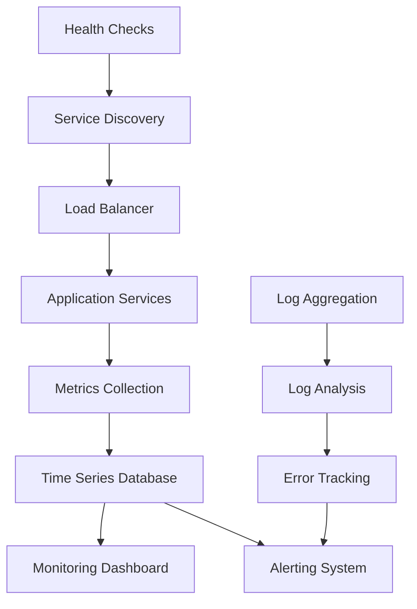

# Performance Monitoring and Metrics

This document provides comprehensive guidance on monitoring and optimizing the performance of the CitadelAI platform, with special focus on the parallel crawling system and system prompt generation.

## Overview

The CitadelAI platform requires careful monitoring to ensure optimal performance across multiple services:

- **System Prompt Generation**: Real-time prompt creation and context integration
- **Web Crawling**: High-throughput parallel content processing
- **Vector Search**: Semantic search and content retrieval
- **AI Response Generation**: Language model interaction and response streaming

## Key Performance Indicators (KPIs)

### System Prompt Generation Metrics

#### Response Time Metrics
- **Prompt Generation Time**: Time to create system prompts
- **Context Retrieval Time**: Weaviate query performance
- **Total Response Time**: End-to-end response generation
- **Cache Hit Rate**: Configuration caching effectiveness

#### Throughput Metrics
- **Requests per Second**: System prompt generation rate
- **Concurrent Users**: Simultaneous active users
- **Queue Length**: Pending prompt generation requests
- **Error Rate**: Failed prompt generations

#### Quality Metrics
- **Context Relevance**: Quality of retrieved context
- **Prompt Completeness**: Percentage of complete prompts
- **User Satisfaction**: Response quality ratings

### Web Crawling Metrics

#### Concurrency Metrics
- **Active Jobs**: Number of concurrent crawl jobs
- **Active Crawlers**: Number of pages being processed
- **Queue Length**: Jobs waiting for processing
- **Resource Utilization**: CPU, memory, and network usage

#### Processing Metrics
- **Pages per Minute**: Crawling throughput
- **Content Processing Rate**: Content extraction speed
- **Batch Processing Time**: Time to process content batches
- **Storage Rate**: Weaviate storage performance

#### Quality Metrics
- **Success Rate**: Percentage of successful page crawls
- **Content Quality**: Relevance of extracted content
- **Error Recovery**: Automatic retry success rate
- **Data Completeness**: Percentage of complete content extraction

### Vector Search Metrics

#### Query Performance
- **Query Latency**: Time to retrieve relevant content
- **Index Size**: Total content chunks indexed
- **Search Accuracy**: Relevance of search results
- **Cache Performance**: Query result caching

#### Storage Metrics
- **Index Growth Rate**: Rate of content indexing
- **Storage Utilization**: Weaviate storage usage
- **Chunk Distribution**: Content chunk size distribution
- **Vector Quality**: Embedding quality metrics

## Monitoring Architecture

### Metrics Collection Stack



### Monitoring Tools

#### 1. Metrics Collection
- **Custom Metrics**: Application-specific metrics
- **Health Checks**: Service health monitoring

#### 2. Log Management
- **ELK Stack**: Elasticsearch, Logstash, Kibana
- **Fluentd**: Log aggregation
- **Sentry**: Error tracking and monitoring

#### 3. Application Performance Monitoring (APM)
- **New Relic**: Application performance monitoring
- **DataDog**: Infrastructure and application monitoring
- **Custom Dashboards**: Real-time performance visualization

## System Prompt Generation Monitoring

### Key Metrics to Track

#### 1. Response Time Metrics
```typescript
interface PromptGenerationMetrics {
  promptGenerationTime: number;        // ms
  contextRetrievalTime: number;        // ms
  totalResponseTime: number;           // ms
  cacheHitRate: number;                // percentage
}
```

#### 2. Throughput Metrics
```typescript
interface ThroughputMetrics {
  requestsPerSecond: number;
  concurrentUsers: number;
  queueLength: number;
  errorRate: number;                   // percentage
}
```

#### 3. Quality Metrics
```typescript
interface QualityMetrics {
  contextRelevanceScore: number;       // 0-1
  promptCompleteness: number;          // percentage
  userSatisfactionScore: number;       // 1-5
}
```

### Monitoring Implementation

#### Custom Metrics Collection
```typescript
// System prompt generation timing
// Track duration of system prompt generation
let promptGenerationTimes: number[] = [];

// Context retrieval timing
// Track duration of context retrieval from Weaviate
let contextRetrievalTimes: number[] = [];

// Cache hit rate
// Track cache hit rate for system prompt generation
let cacheHits = 0;
let cacheMisses = 0;

function getCacheHitRate(): number {
  const total = cacheHits + cacheMisses;
  return total > 0 ? cacheHits / total : 0;
}
```

#### Performance Monitoring Code
```typescript
export async function generateSystemPrompt(
  systemPromptBlock: Block | null,
  contextBlocks: Block[],
  context: string
): Promise<string> {
  const startTime = Date.now();
  
  try {
    // Generate system prompt
    const prompt = await generatePrompt(systemPromptBlock, contextBlocks);
    
    // Record metrics
    promptGenerationTimer.observe((Date.now() - startTime) / 1000);
    
    return prompt;
  } catch (error) {
    // Record error metrics
    errorCounter.inc();
    throw error;
  }
}
```

### Alerting Rules

#### Critical Alerts
- **High Response Time**: Average response time > 2 seconds
- **High Error Rate**: Error rate > 5%
- **Low Cache Hit Rate**: Cache hit rate < 70%
- **Queue Overflow**: Queue length > 100 requests

#### Warning Alerts
- **Increasing Response Time**: 20% increase in response time
- **Memory Usage**: Memory usage > 80%
- **Database Connections**: Connection pool > 80% utilized

## Web Crawling Monitoring

### Key Metrics to Track

#### 1. Concurrency Metrics
```typescript
interface ConcurrencyMetrics {
  activeJobs: number;
  activeCrawlers: number;
  maxConcurrentJobs: number;
  maxCrawlersPerJob: number;
  queueLength: number;
  resourceUtilization: {
    cpu: number;                       // percentage
    memory: number;                    // percentage
    network: number;                   // percentage
  };
}
```

#### 2. Processing Metrics
```typescript
interface ProcessingMetrics {
  pagesPerMinute: number;
  contentProcessingRate: number;       // items/second
  batchProcessingTime: number;         // ms
  storageRate: number;                 // chunks/second
  successRate: number;                 // percentage
}
```

#### 3. Quality Metrics
```typescript
interface CrawlingQualityMetrics {
  contentRelevanceScore: number;       // 0-1
  extractionCompleteness: number;      // percentage
  errorRecoveryRate: number;           // percentage
  dataConsistency: number;             // percentage
}
```

### Monitoring Implementation

#### Concurrency Status Monitoring
```typescript
// Active jobs counter
let activeJobsCount = 0;

// Active crawlers counter
let activeCrawlersCount = 0;

// Queue length
let queueLength = 0;

// Processing rate tracking
let processingDurations: number[] = [];
```

#### Real-time Status Endpoint
```typescript
app.get('/metrics/concurrency', (req, res) => {
  const status = crawlingService.getConcurrencyStatus();
  
  res.json({
    timestamp: new Date().toISOString(),
    concurrency: {
      activeJobs: status.activeJobsCount,
      activeCrawlers: status.totalActiveCrawlers,
      maxConcurrentJobs: status.maxConcurrentJobs,
      maxCrawlersPerJob: status.maxCrawlersPerJob,
      queueLength: status.queueLength
    },
    performance: {
      averageProcessingTime: calculateAverageProcessingTime(),
      successRate: calculateSuccessRate(),
      errorRate: calculateErrorRate()
    }
  });
});
```

### Performance Optimization

#### 1. Concurrency Tuning
```typescript
// Dynamic concurrency adjustment based on system load
function adjustConcurrency() {
  const cpuUsage = getCpuUsage();
  const memoryUsage = getMemoryUsage();
  
  if (cpuUsage > 80 || memoryUsage > 85) {
    // Reduce concurrency
    maxConcurrentJobs = Math.max(2, maxConcurrentJobs - 1);
    maxCrawlersPerJob = Math.max(3, maxCrawlersPerJob - 1);
  } else if (cpuUsage < 50 && memoryUsage < 60) {
    // Increase concurrency
    maxConcurrentJobs = Math.min(6, maxConcurrentJobs + 1);
    maxCrawlersPerJob = Math.min(8, maxCrawlersPerJob + 1);
  }
}
```

#### 2. Batch Size Optimization
```typescript
// Dynamic batch size adjustment
function optimizeBatchSize() {
  const processingTime = getAverageProcessingTime();
  const memoryUsage = getMemoryUsage();
  
  if (processingTime > 5000 && memoryUsage < 70) {
    // Increase batch size for better throughput
    batchSize = Math.min(10, batchSize + 1);
  } else if (processingTime < 2000 && memoryUsage > 80) {
    // Decrease batch size to reduce memory usage
    batchSize = Math.max(3, batchSize - 1);
  }
}
```

## Vector Search Monitoring

### Key Metrics to Track

#### 1. Query Performance
```typescript
interface QueryMetrics {
  queryLatency: number;                // ms
  queryThroughput: number;             // queries/second
  cacheHitRate: number;                // percentage
  indexSize: number;                   // number of chunks
  searchAccuracy: number;              // 0-1
}
```

#### 2. Storage Metrics
```typescript
interface StorageMetrics {
  indexGrowthRate: number;             // chunks/hour
  storageUtilization: number;          // percentage
  chunkSizeDistribution: {
    min: number;
    max: number;
    average: number;
    median: number;
  };
  vectorQuality: number;               // 0-1
}
```

### Monitoring Implementation

#### Query Performance Monitoring
```typescript
// Query latency tracking
let queryLatencies: number[] = [];

// Query throughput counter
let totalQueries = 0;

// Cache hit rate tracking
let weaviateCacheHits = 0;
let weaviateCacheMisses = 0;

function getWeaviateCacheHitRate(): number {
  const total = weaviateCacheHits + weaviateCacheMisses;
  return total > 0 ? weaviateCacheHits / total : 0;
}
```

## Dashboard Configuration

### System Prompt Generation Dashboard

#### Key Panels
1. **Response Time Trends**
   - Average response time over time
   - 95th percentile response time
   - Response time distribution

2. **Throughput Metrics**
   - Requests per second
   - Concurrent users
   - Queue length

3. **Error Analysis**
   - Error rate over time
   - Error types breakdown
   - Error recovery rate

4. **Cache Performance**
   - Cache hit rate
   - Cache miss reasons
   - Cache size and utilization

### Web Crawling Dashboard

#### Key Panels
1. **Concurrency Overview**
   - Active jobs and crawlers
   - Queue length and processing rate
   - Resource utilization

2. **Processing Performance**
   - Pages per minute
   - Content processing rate
   - Batch processing efficiency

3. **Quality Metrics**
   - Success rate
   - Content relevance scores
   - Error recovery rate

4. **Storage Performance**
   - Weaviate storage rate
   - Index growth
   - Storage utilization

### Vector Search Dashboard

#### Key Panels
1. **Query Performance**
   - Query latency trends
   - Query throughput
   - Search accuracy

2. **Index Health**
   - Index size and growth
   - Vector quality metrics
   - Storage utilization

3. **Cache Performance**
   - Cache hit rate
   - Cache efficiency
   - Cache size

## Alerting Configuration

### Critical Alerts

#### System Prompt Generation
```yaml
- alert: HighPromptGenerationTime
  expr: avg(system_prompt_generation_duration_seconds) > 2
  for: 5m
  labels:
    severity: critical
  annotations:
    summary: "System prompt generation is slow"
    description: "Average response time is {{ $value }}s"

- alert: HighErrorRate
  expr: rate(system_prompt_errors_total[5m]) > 0.05
  for: 2m
  labels:
    severity: critical
  annotations:
    summary: "High error rate in system prompt generation"
    description: "Error rate is {{ $value }} errors per second"
```

#### Web Crawling
```yaml
- alert: CrawlingQueueOverflow
  expr: crawling_queue_length > 50
  for: 5m
  labels:
    severity: critical
  annotations:
    summary: "Crawling queue is overflowing"
    description: "Queue length is {{ $value }} jobs"

- alert: LowCrawlingSuccessRate
  expr: rate(crawling_successful_pages_total[5m]) / rate(crawling_total_pages_total[5m]) < 0.8
  for: 10m
  labels:
    severity: critical
  annotations:
    summary: "Low crawling success rate"
    description: "Success rate is {{ $value }}%"
```

### Warning Alerts

#### Resource Utilization
```yaml
- alert: HighMemoryUsage
  expr: (node_memory_MemTotal_bytes - node_memory_MemAvailable_bytes) / node_memory_MemTotal_bytes > 0.8
  for: 5m
  labels:
    severity: warning
  annotations:
    summary: "High memory usage"
    description: "Memory usage is {{ $value }}%"

- alert: HighCPUUsage
  expr: 100 - (avg by (instance) (irate(node_cpu_seconds_total{mode="idle"}[5m])) * 100) > 80
  for: 5m
  labels:
    severity: warning
  annotations:
    summary: "High CPU usage"
    description: "CPU usage is {{ $value }}%"
```

## Performance Testing

### Load Testing Scenarios

#### 1. System Prompt Generation Load Test
```bash
# Test concurrent prompt generation
k6 run --vus 100 --duration 5m system-prompt-load-test.js
```

```javascript
// system-prompt-load-test.js
import http from 'k6/http';
import { check } from 'k6';

export let options = {
  stages: [
    { duration: '2m', target: 50 },
    { duration: '5m', target: 100 },
    { duration: '2m', target: 0 },
  ],
};

export default function() {
  let response = http.post('http://localhost:3000/api/chat/respond', {
    message: 'What is the company policy?',
    chatSessionId: 'test-session-' + Math.random()
  });
  
  check(response, {
    'status is 200': (r) => r.status === 200,
    'response time < 2s': (r) => r.timings.duration < 2000,
  });
}
```

#### 2. Web Crawling Load Test
```bash
# Test concurrent crawling jobs
k6 run --vus 10 --duration 10m crawling-load-test.js
```

```javascript
// crawling-load-test.js
import http from 'k6/http';
import { check } from 'k6';

export let options = {
  stages: [
    { duration: '2m', target: 5 },
    { duration: '8m', target: 10 },
    { duration: '2m', target: 0 },
  ],
};

export default function() {
  let response = http.post('http://localhost:3001/crawl', {
    url: 'https://httpbin.org/html',
    chatbotId: 'test-chatbot-' + Math.random(),
    blockId: 'test-block-' + Math.random(),
    recursive: true,
    maxDepth: 2
  });
  
  check(response, {
    'status is 200': (r) => r.status === 200,
    'job queued': (r) => JSON.parse(r.body).message.includes('queued'),
  });
}
```

### Performance Benchmarks

#### Expected Performance Targets

| Metric | Target | Warning | Critical |
|--------|--------|---------|----------|
| System Prompt Generation | < 500ms | > 1s | > 2s |
| Web Crawling (pages/min) | > 50 | < 30 | < 20 |
| Vector Search Query | < 200ms | > 500ms | > 1s |
| Memory Usage | < 70% | > 80% | > 90% |
| CPU Usage | < 70% | > 80% | > 90% |
| Error Rate | < 1% | > 3% | > 5% |

## Troubleshooting Guide

### Common Performance Issues

#### 1. Slow System Prompt Generation
**Symptoms**: High response times, user complaints
**Causes**: 
- Slow Weaviate queries
- Inefficient context retrieval
- Database connection issues

**Solutions**:
- Optimize Weaviate queries
- Implement query caching
- Increase database connection pool
- Add query timeouts

#### 2. Crawling Performance Issues
**Symptoms**: Low pages/minute, high queue length
**Causes**:
- Network latency
- Complex page structures
- Resource constraints

**Solutions**:
- Adjust concurrency settings
- Optimize content extraction
- Implement better retry logic
- Scale resources

#### 3. Vector Search Performance
**Symptoms**: Slow query responses, timeouts
**Causes**:
- Large index size
- Inefficient queries
- Resource constraints

**Solutions**:
- Optimize index structure
- Implement query caching
- Scale Weaviate resources
- Add query optimization

### Performance Optimization Checklist

#### System Prompt Generation
- [ ] Implement prompt caching
- [ ] Optimize Weaviate queries
- [ ] Add query timeouts
- [ ] Monitor cache hit rates
- [ ] Implement connection pooling

#### Web Crawling
- [ ] Tune concurrency settings
- [ ] Optimize batch processing
- [ ] Implement intelligent retry logic
- [ ] Monitor resource utilization
- [ ] Add performance metrics

#### Vector Search
- [ ] Optimize index structure
- [ ] Implement query caching
- [ ] Monitor query performance
- [ ] Add query optimization
- [ ] Scale storage resources

## Continuous Monitoring

### Automated Performance Testing
- **Daily Load Tests**: Automated performance validation
- **Weekly Stress Tests**: Identify breaking points
- **Monthly Capacity Planning**: Resource planning and scaling

### Performance Reviews
- **Weekly Performance Reviews**: Analyze trends and issues
- **Monthly Optimization**: Implement performance improvements
- **Quarterly Architecture Review**: Evaluate system architecture

### Capacity Planning
- **Growth Projections**: Plan for increased load
- **Resource Scaling**: Proactive resource allocation
- **Performance Budgets**: Set and maintain performance targets