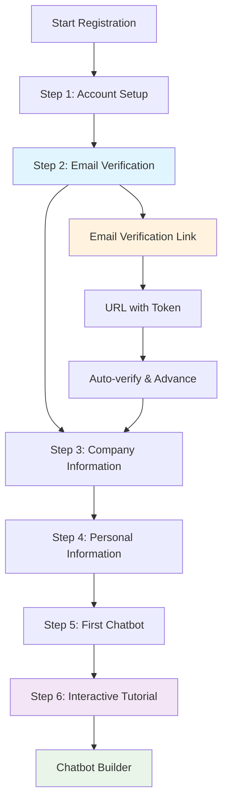

# Multi-Step Registration Flow Documentation

This document describes the comprehensive multi-step registration flow implemented in the CitadelAI admin interface, including email verification and state management.

## Overview

The registration system provides a seamless, step-by-step onboarding experience for new admin users, with built-in email verification and automatic chatbot creation.

## Registration Flow Architecture

### Flow Diagram



### Step Details

#### Step 1: Account Setup
- **Purpose**: Collect basic authentication credentials
- **Fields**: Email address, password, password confirmation
- **Validation**: Email format, password strength (8+ characters), password match
- **Navigation**: Can only proceed to Step 2

#### Step 2: Email Verification
- **Purpose**: Verify email address ownership
- **States**: 
  - Pending: Shows verification instructions
  - Verifying: Loading state during token processing
  - Verified: Success state with continue option
  - Error: Invalid/expired token handling
- **Navigation**: Cannot proceed until verified, cannot go back after verification

#### Step 3: Company Information
- **Purpose**: Collect organization details
- **Fields**: Company name
- **Navigation**: Cannot go back to Steps 1-2 (email verification lock)

#### Step 4: Personal Information
- **Purpose**: Collect personal profile information
- **Fields**: Full name
- **Navigation**: Cannot go back to Steps 1-2

#### Step 5: First Chatbot Creation
- **Purpose**: Create initial chatbot for immediate use
- **Fields**: Chatbot name, description (optional)
- **Action**: Automatically creates chatbot with backend
- **Navigation**: Cannot go back to Steps 1-2

#### Step 6: Interactive Tutorial (Auto-Launch)
- **Purpose**: Guide new users through the chatbot builder interface
- **Trigger**: Automatically launches after chatbot creation
- **Features**: Step-by-step guided tour with visual highlights
- **Duration**: 10 interactive steps covering all major features
- **Navigation**: Can be skipped or restarted at any time

## State Management

### RegistrationContext

The `RegistrationContext` manages the entire registration state:

```typescript
interface RegistrationData {
  // Step 1: Basic Auth
  email: string;
  password: string;
  
  // Step 2: Email Verification
  emailVerified: boolean;
  verificationToken?: string;
  
  // Step 3: Company Info
  company: string;
  
  // Step 4: Personal Info
  name: string;
  
  // Step 5: First Chatbot
  chatbotName: string;
  chatbotDescription?: string;
}
```

### Key Features

- **Persistent State**: All data saved to localStorage
- **Step Navigation**: Forward/backward with validation
- **Email Verification**: Token handling and status tracking
- **Navigation Restrictions**: Prevents going back after verification
- **Progress Tracking**: Visual progress indicator

## Email Verification System

### URL-Based Verification

Email verification works through URL parameters:

```
/register?token=verification-token-123
```

### Verification Process

1. **User reaches Step 2**: Email verification step displays
2. **System generates token**: Unique verification token created
3. **User receives email**: Contains verification link with token
4. **User clicks link**: Navigates to registration page with token
5. **System processes token**: Validates and verifies email
6. **State updates**: `emailVerified = true`, advance to Step 3
7. **Navigation locks**: Cannot return to Steps 1-2

### Development Mode

For testing without email sending:

- **Console Logging**: Verification URL logged to browser console
- **Visual Helper**: Yellow development box shows verification URL
- **Easy Testing**: Copy-paste URL to test verification flow

## Backend Integration

### Registration Endpoint

```http
POST /api/admin/auth/register
Content-Type: application/json

{
  "email": "user@example.com",
  "password": "hashedPassword",
  "company": "Company Name",
  "name": "Full Name"
}
```

### Chatbot Creation Endpoint

```http
POST /api/admin/chatbots
Authorization: Bearer <token>
Content-Type: application/json

{
  "name": "My First Chatbot",
  "description": "Optional description"
}
```

### Backend Features

- **Automatic Block Creation**: Creates System Prompt and Custom Interface blocks
- **Description Integration**: Sets chatbot description in Custom Interface block
- **Test User Creation**: Creates associated test user for chatbot access
- **Default Configuration**: Sets up basic chatbot workflow

## Interactive Tutorial System

### Overview

The tutorial system provides an immersive, step-by-step guided tour of the chatbot builder interface, automatically launching for new users after account creation.

### Tutorial Features

#### Visual Design
- **Sliding Bubbles**: Contextual information bubbles that attach to specific UI elements
- **Highlight System**: Bright, transparent cutouts that highlight relevant interface areas
- **Smooth Animations**: Fluid transitions between tutorial steps with fade and slide effects
- **Progress Tracking**: Visual progress bar showing current step (e.g., "Step 3 of 10")

#### Navigation
- **Keyboard Support**: Arrow keys (←/→) and Space bar for navigation
- **Mouse Controls**: Next/Previous buttons for mouse users
- **Skip Option**: Ability to skip the entire tutorial at any time
- **Restart Capability**: Tutorial can be restarted from Settings → Tutorial tab

#### Tutorial Steps

1. **Welcome**: Introduction to the chatbot builder interface
2. **Block Library**: Overview of the left panel with available blocks
3. **Canvas Area**: Introduction to the main workspace
4. **System Prompt Block**: Explanation of the core AI configuration
5. **Add Frontend Interface**: Guide to adding user interface blocks
6. **Add Action Block**: Introduction to action-based blocks
7. **Test Mode**: How to test the chatbot functionality
8. **Settings**: Access to chatbot configuration and deployment
9. **Block Properties**: How to configure individual blocks
10. **Completion**: Summary and next steps

### Technical Implementation

#### Context Management
- **TutorialContext**: React context managing tutorial state and navigation
- **Local Storage**: Persists tutorial completion status across sessions
- **State Management**: Tracks current step, completion status, and user preferences

#### Element Targeting
- **CSS Selectors**: Targets specific UI elements for highlighting
- **Dynamic Positioning**: Calculates optimal bubble placement based on element position
- **Viewport Awareness**: Ensures bubbles remain visible within screen bounds
- **Responsive Design**: Adapts to different screen sizes and orientations

#### Overlay System
- **Base Overlay**: Semi-transparent dark background covering the entire interface
- **Cutout Effect**: Transparent "windows" that reveal highlighted elements
- **Z-Index Management**: Proper layering to ensure elements appear above overlays
- **Smooth Transitions**: Animated cutout movements between tutorial steps

### User Experience Benefits

#### Onboarding
- **Reduced Learning Curve**: New users quickly understand interface capabilities
- **Contextual Learning**: Information appears exactly where it's needed
- **Non-Intrusive**: Can be skipped or paused at any time
- **Comprehensive Coverage**: Covers all major features and workflows

#### Accessibility
- **Keyboard Navigation**: Full keyboard support for accessibility
- **Screen Reader Support**: Proper ARIA labels and descriptions
- **High Contrast**: Clear visual distinction between highlighted and dimmed areas
- **Focus Management**: Logical tab order and focus indicators

### Integration Points

#### Settings Modal
- **Tutorial Tab**: Dedicated tab in Settings → Tutorial
- **Auto-Close**: Settings modal automatically closes when tutorial starts
- **Restart Option**: Users can restart tutorial from settings

#### Auto-Launch Logic
- **First-Time Users**: Tutorial automatically launches for new accounts
- **Block Independence**: Works regardless of existing blocks on canvas
- **Timing**: 1-second delay ensures smooth startup after page load

### Future Enhancements

#### Planned Features
1. **Customizable Tutorials**: Different tutorial paths for different user types
2. **Interactive Demos**: Hands-on practice with guided actions
3. **Video Integration**: Optional video explanations for complex features
4. **Progress Analytics**: Track tutorial completion rates and drop-off points
5. **Multi-language Support**: Tutorial content in multiple languages

#### Technical Improvements
1. **Performance Optimization**: Lazy loading of tutorial assets
2. **Mobile Optimization**: Touch-friendly tutorial controls
3. **Offline Support**: Tutorial works without internet connection
4. **A/B Testing**: Test different tutorial approaches
5. **Analytics Integration**: Detailed tutorial usage analytics

## User Experience Features

### Visual Design

- **Consistent Width**: All steps use 512px width for uniformity
- **Progress Indicator**: Modern flat black progress bar
- **Step Indicators**: Clean, minimal step circles with checkmarks
- **Smooth Animations**: Direction-aware slide transitions
- **Loading States**: Spinner animations during processing

### Navigation

- **Enter Key Support**: Press Enter to advance through steps
- **Back Button Logic**: Conditional back buttons based on verification status
- **State Persistence**: Resume registration from any step
- **Error Handling**: Clear error messages and validation feedback

### Accessibility

- **Keyboard Navigation**: Full keyboard support
- **Screen Reader Support**: Proper ARIA labels and descriptions
- **Focus Management**: Logical tab order and focus indicators
- **Error Announcements**: Clear error messaging

## Testing

### Manual Testing Flow

1. **Start Registration**: Navigate to `/register`
2. **Complete Step 1**: Enter valid email and password
3. **Reach Step 2**: Email verification step appears
4. **Check Console**: Look for verification URL in browser console
5. **Test Verification**: Copy URL and open in new tab
6. **Verify Success**: Should automatically advance to Step 3
7. **Test Navigation**: Verify you cannot go back to Steps 1-2
8. **Complete Flow**: Finish all 5 steps and verify chatbot creation

### Development Testing

- **Console Logging**: Verification URLs logged with clear instructions
- **Visual Helper**: Yellow development box shows verification URL
- **State Inspection**: Check localStorage for registration data
- **Network Monitoring**: Verify API calls and responses

### Automated Testing

- **Unit Tests**: Test individual step components
- **Integration Tests**: Test complete registration flow
- **State Tests**: Verify RegistrationContext state management
- **Navigation Tests**: Test step navigation and restrictions

## Security Considerations

### Email Verification

- **Token Validation**: Backend validates verification tokens
- **Expiration Handling**: Tokens expire after reasonable time
- **One-Time Use**: Tokens can only be used once
- **Rate Limiting**: Prevent abuse of verification system

### Data Protection

- **Password Hashing**: Passwords hashed before storage
- **Secure Storage**: Sensitive data properly encrypted
- **Input Validation**: All inputs validated and sanitized
- **CSRF Protection**: Cross-site request forgery protection

### Session Management

- **JWT Tokens**: Secure token-based authentication
- **Token Expiry**: Automatic session expiration
- **Logout Handling**: Proper cleanup on logout
- **State Persistence**: Secure localStorage usage

## Future Enhancements

### Planned Features

1. **Real Email Sending**: Integration with email service provider
2. **SMS Verification**: Alternative verification method
3. **Social Login**: OAuth integration (Google, Microsoft)
4. **Company Domain Validation**: Verify company email domains
5. **Bulk Registration**: Admin can create multiple accounts

### Technical Improvements

1. **Token Refresh**: Automatic token refresh before expiry
2. **Offline Support**: PWA capabilities for offline registration
3. **Multi-language**: Internationalization support
4. **Analytics**: Registration funnel analytics
5. **A/B Testing**: Test different registration flows

### Security Enhancements

1. **CAPTCHA**: Bot protection for registration
2. **Device Fingerprinting**: Additional security layer
3. **Audit Logging**: Track registration attempts
4. **IP Whitelisting**: Restrict registration by IP
5. **Email Domain Validation**: Company domain verification

## Troubleshooting

### Common Issues

1. **Verification Not Working**: Check token format and expiration
2. **State Not Persisting**: Verify localStorage is enabled
3. **Navigation Issues**: Check canGoBack() logic
4. **API Errors**: Verify backend endpoints are running
5. **UI Not Loading**: Check component imports and routing

### Debug Mode

Enable debug logging by adding console.log statements in:
- `RegistrationContext.tsx` - Log state changes
- `Step2EmailVerification.tsx` - Log verification process
- `apiClient.ts` - Log API calls and responses

### Error Messages

- **"Invalid verification token"**: Token is expired or malformed
- **"Email already exists"**: User already registered
- **"Session expired"**: JWT token has expired
- **"Network error"**: Backend is unreachable
- **"Validation failed"**: Form validation errors

## API Reference

### Registration Context Methods

```typescript
interface RegistrationContextType {
  currentStep: number;
  totalSteps: number;
  registrationData: RegistrationData;
  isComplete: boolean;
  goToNextStep: () => void;
  goToPreviousStep: () => void;
  goToStep: (step: number) => void;
  updateRegistrationData: (data: Partial<RegistrationData>) => void;
  resetRegistration: () => void;
  canProceed: (step: number) => boolean;
  canGoBack: (step: number) => boolean;
  verifyEmail: (token: string) => void;
}
```

### Step Components

- `Step1Auth.tsx` - Account setup form
- `Step2EmailVerification.tsx` - Email verification with URL handling
- `Step3Company.tsx` - Company information form
- `Step4Personal.tsx` - Personal information form
- `Step5Chatbot.tsx` - Chatbot creation and registration completion

### Utility Functions

- `RegistrationFlow.tsx` - Main flow component with progress indicator
- `MultiStepRegisterPage.tsx` - Page wrapper with context provider
- `api.ts` - API functions for registration and chatbot creation