# CitadelAI Service Interaction Diagrams

This document provides detailed visual diagrams showing the routes, data flow, and interactions between all services in the CitadelAI platform.

## Container Network Architecture

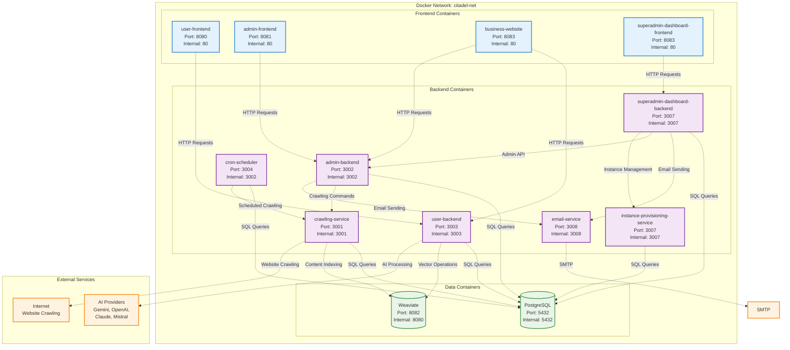

## API Route Mapping

### User Service Routes (Port 3003)

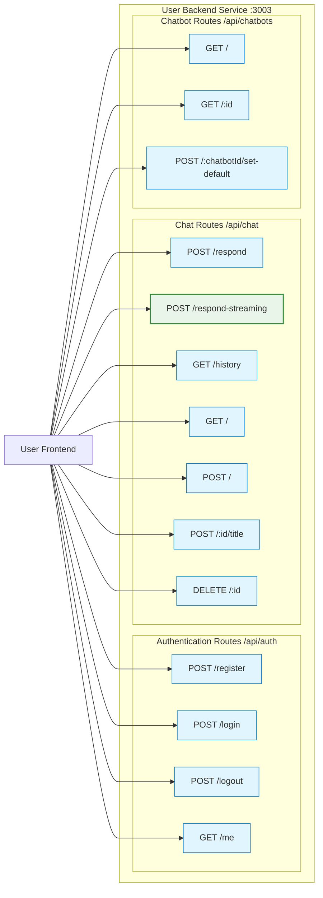

### Admin Service Routes (Port 3002)

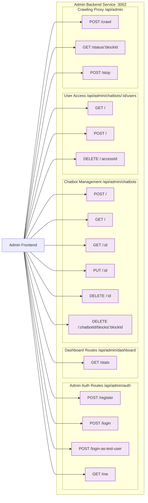

### Crawling Service Routes (Port 3001)

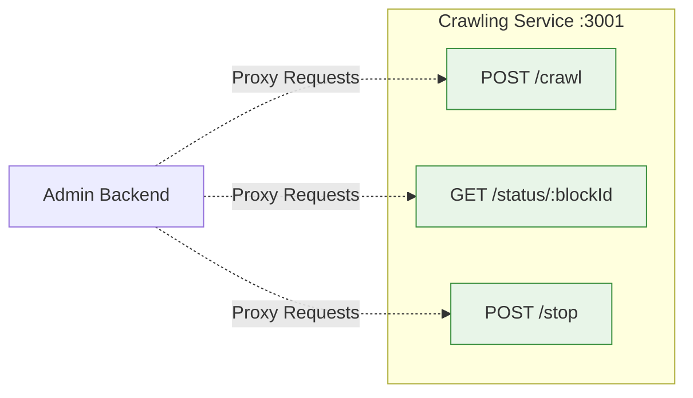

### Cron Scheduler Routes (Port 3004)

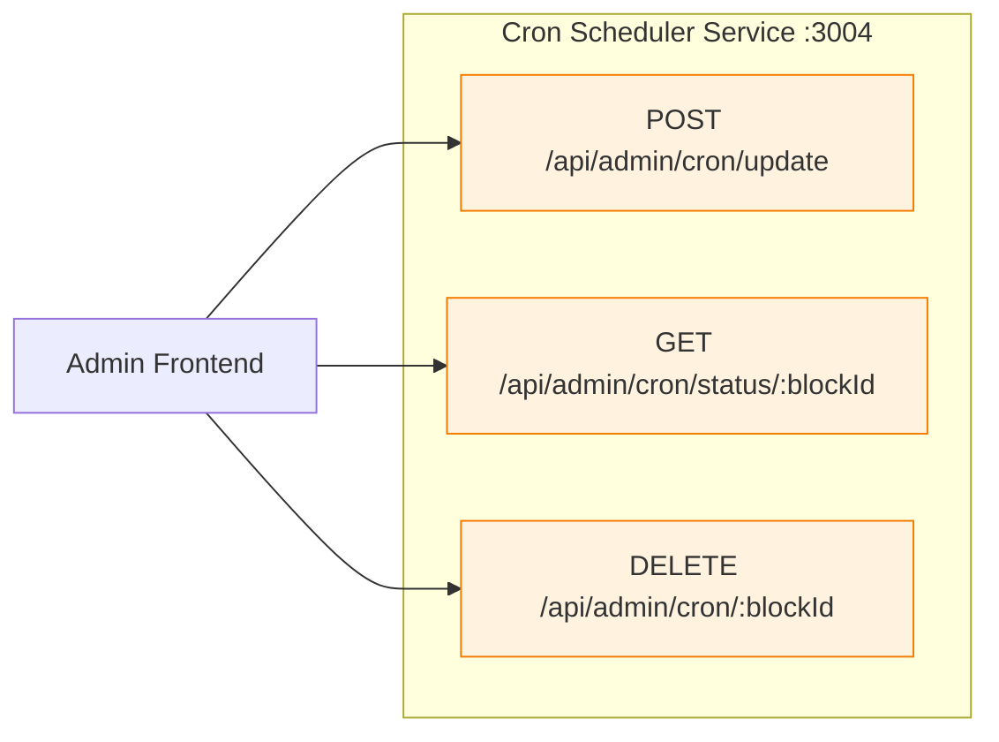

## Data Flow Patterns

### User Registration and Authentication Flow

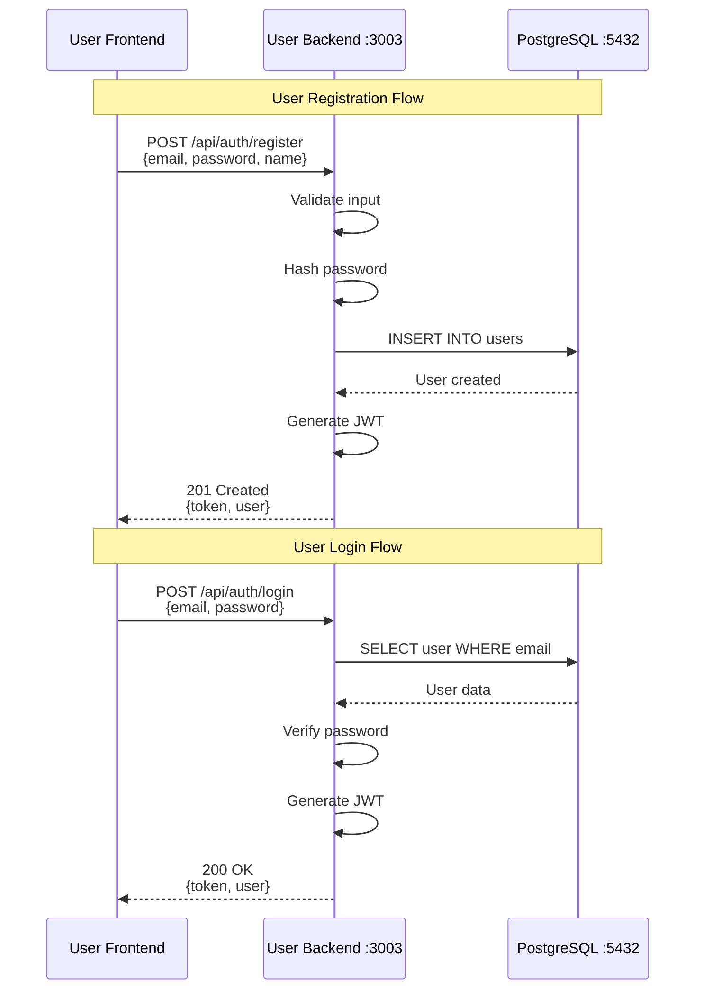

### Real-time Streaming Chat Flow

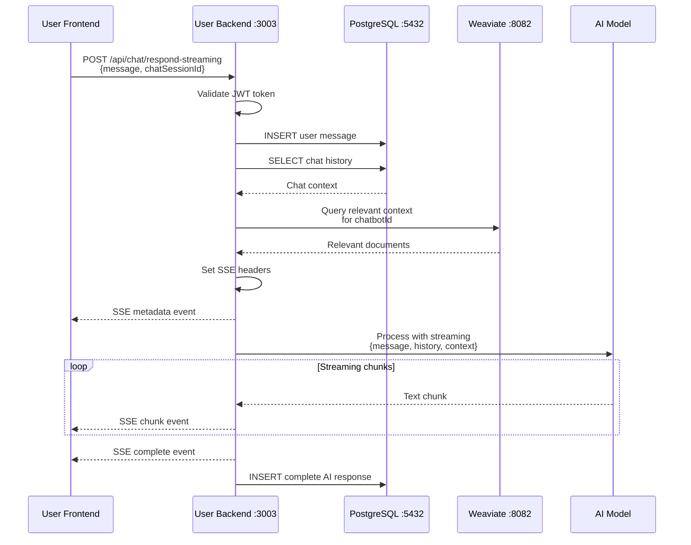

### Traditional Chat Flow (Fallback)

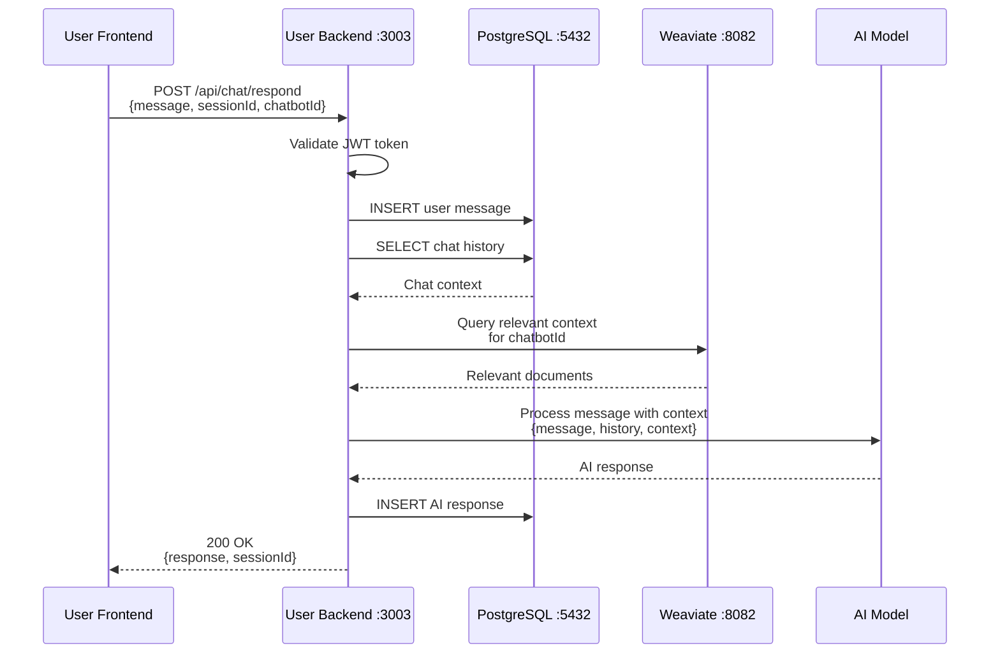

### Admin Chatbot Creation Flow

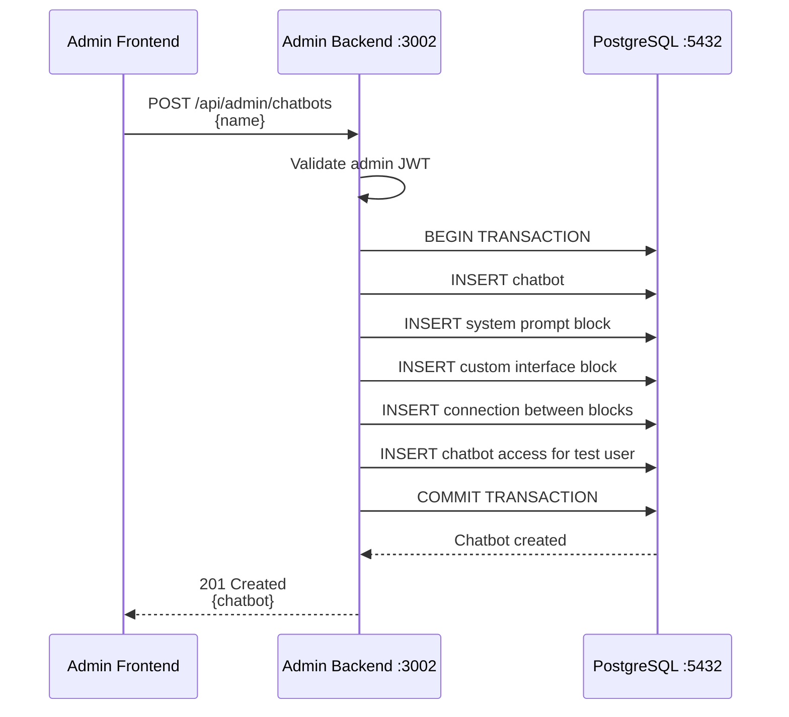

### Website Crawling Flow

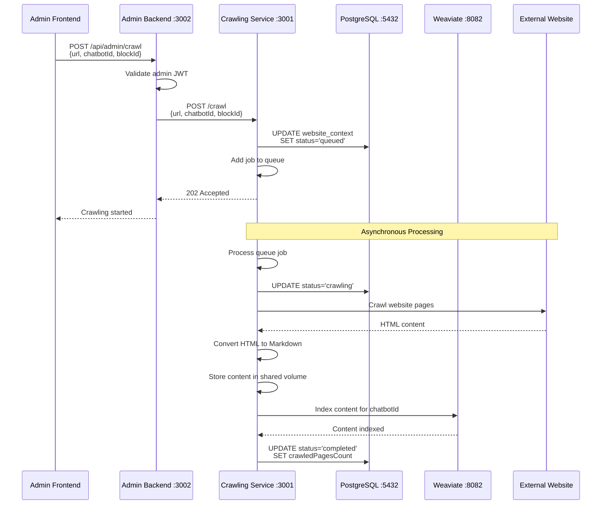

### Cron Scheduled Crawling Flow

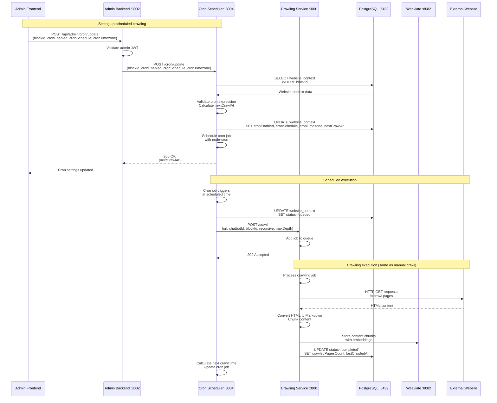

### Real-time Status Monitoring

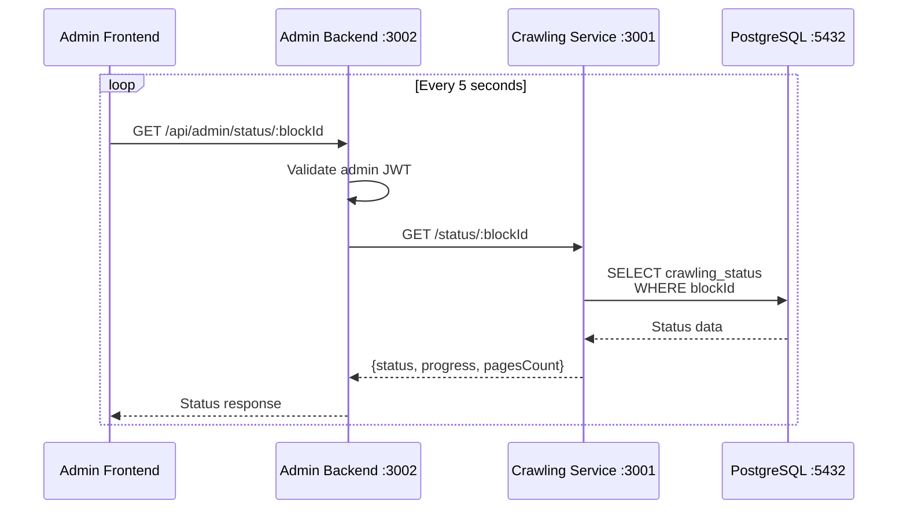

## Service Dependencies

### Container Startup Dependencies

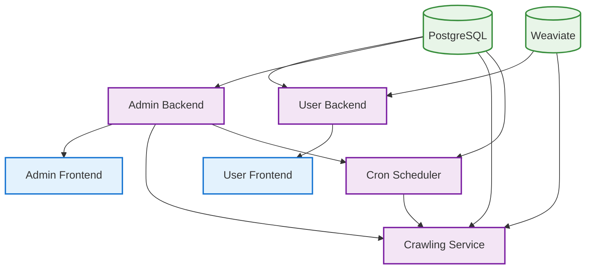

### Health Check Dependencies

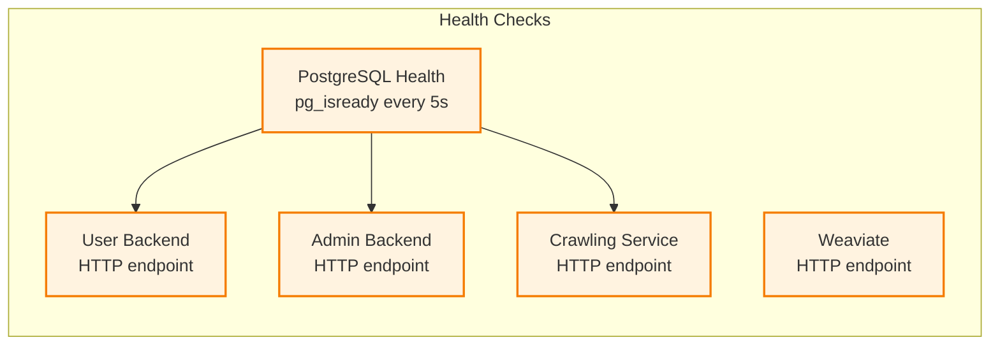

## Network Communication Patterns

### Internal Service Communication

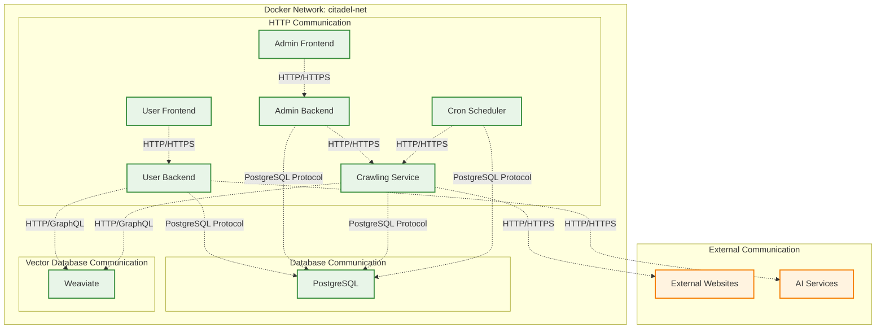

### Port Exposure and Access

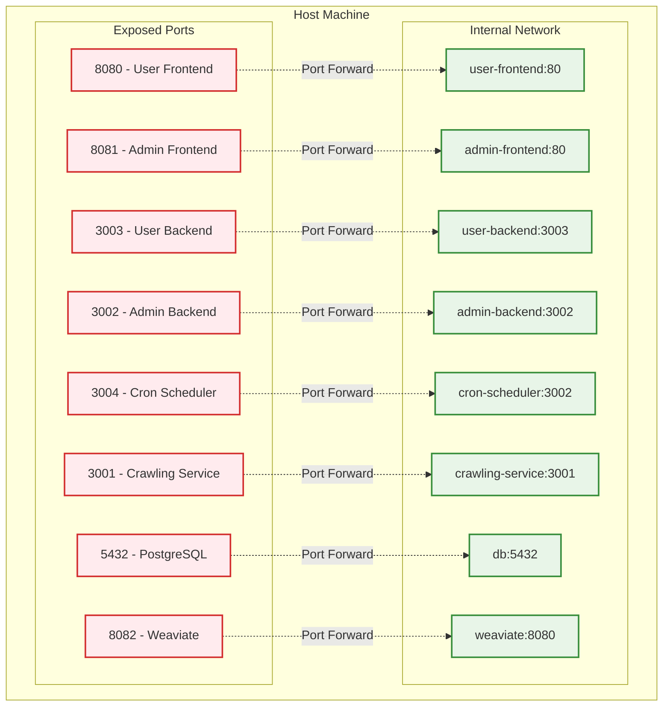

This comprehensive set of diagrams provides a complete visual representation of how all services interact, communicate, and depend on each other within the CitadelAI platform. The diagrams show both the static architecture and dynamic data flows that occur during normal operation.