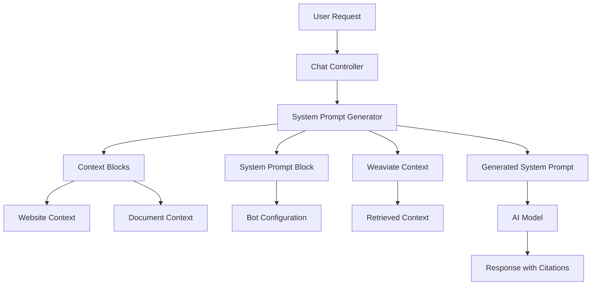

# System Prompt Generation

The CitadelAI system uses a sophisticated prompt generation system that dynamically creates context-aware system prompts for AI chatbots. This system combines user configuration, knowledge sources, and real-time context to provide highly personalized and accurate AI responses.

## Overview

The system prompt generation process is responsible for:
- Creating personalized AI assistant personas based on user configuration
- Integrating knowledge from multiple sources (websites, documents)
- Providing context-aware instructions for AI responses
- Ensuring consistent behavior across different chatbot instances

## Architecture



## System Prompt Generator

The core system prompt generation logic is located in `user/backend/src/utils/systemPromptGenerator.ts`.

### Configuration Interface

```typescript
interface SystemPromptConfig {
  botName?: string;
  companyName?: string;
  behavior?: string;
  additionalInstructions?: string;
}
```

### Behavior Types

The system supports six predefined behavior types:

| Behavior | Description |
|----------|-------------|
| `helpful` | Friendly, informative, and eager to help with any questions |
| `professional` | Formal, knowledgeable, and focused on providing expert advice |
| `casual` | Relaxed, conversational, and approachable in tone |
| `technical` | Precise, detailed, and focused on technical accuracy |
| `creative` | Imaginative, inspiring, and focused on creative solutions |
| `supportive` | Empathetic, patient, and focused on helping users succeed |

### Generation Process

#### 1. Configuration Retrieval

The system retrieves the system prompt block from the database:

```typescript
const systemPromptBlock = await prisma.block.findFirst({
  where: {
    chatbotId: chatbotId,
    type: BlockType.LOGIC,
    subtype: 'System Prompt',
  },
});
```

#### 2. Context Block Integration

Context blocks provide information about available knowledge sources:

```typescript
const contextBlocks = await prisma.block.findMany({
  where: {
    chatbotId: chatbotId,
    type: BlockType.CONTEXT,
  },
});
```

#### 3. Prompt Assembly

The system assembles the final prompt using the following structure:

1. **Base Identity**: "You are [botName]"
2. **Company Context**: "an AI assistant for [companyName]" (if provided)
3. **Behavior Description**: Based on selected behavior type
4. **Knowledge Sources**: List of connected websites and documents
5. **Additional Instructions**: Custom instructions from user
6. **Context Integration**: Real-time context from Weaviate

### Example Generated Prompts

#### Basic Configuration
```
You are Assistant, an AI assistant for Acme Corp. Friendly, informative, and eager to help with any questions.

You have access to the following knowledge sources:
- Website: https://acme-corp.com
- Document: product-manual.pdf

Use this information to provide accurate and helpful responses. Always cite your sources when referencing specific information.

Additional instructions: Focus on customer support scenarios.

Remember to be helpful, accurate, and professional in all your interactions.

Use the following context to answer the user's question:

[Retrieved context from Weaviate...]
```

#### Professional Technical Assistant
```
You are TechBot, an AI assistant for TechCorp. Precise, detailed, and focused on technical accuracy.

You have access to the following knowledge sources:
- Website: https://docs.techcorp.com
- Document: api-reference.pdf

Use this information to provide accurate and helpful responses. Always cite your sources when referencing specific information.

Additional instructions: Provide code examples when explaining technical concepts.

Remember to be helpful, accurate, and professional in all your interactions.

Use the following context to answer the user's question:

[Retrieved context from Weaviate...]
```

## Context Integration

### Weaviate Integration

The system integrates with Weaviate vector database to provide real-time context:

```typescript
const contextData = await getContextFromWeaviate(message, chatbotId);
const context = contextData.context;
const sources = contextData.sources;
```

### Source Tracking

The system tracks and formats sources for proper citation:

- **Website Sources**: Grouped by domain with page references
- **Document Sources**: Grouped by filename with part references
- **Citation Formatting**: Automatic numbering and linking

### Context Retrieval Process

1. **Semantic Search**: Uses message content to find relevant context
2. **Source Filtering**: Filters by chatbotId to ensure context relevance
3. **Content Chunking**: Retrieves content in manageable chunks
4. **Source Metadata**: Preserves source information for citations

## Database Schema

### System Prompt Block

```sql
CREATE TABLE blocks (
  id TEXT PRIMARY KEY,
  chatbotId TEXT NOT NULL,
  type TEXT NOT NULL,
  subtype TEXT NOT NULL,
  properties JSONB,
  -- other fields...
);

-- Example system prompt block
{
  "botName": "Assistant",
  "companyName": "Acme Corp",
  "behavior": "helpful",
  "additionalInstructions": "Focus on customer support"
}
```

### Context Blocks

```sql
-- Website context block
{
  "url": "https://example.com",
  "recursive": true,
  "maxDepth": 3
}

-- Document context block
{
  "filename": "manual.pdf",
  "uploadedAt": "2025-01-01T00:00:00Z"
}
```

## API Integration

### Chat Controller Integration

The system prompt generator is integrated into the chat controller at `user/backend/src/controllers/chat.ts`:

```typescript
// Generate system prompt with context
const systemPromptWithContext = generateSystemPrompt(
  systemPromptBlock, 
  contextBlocks, 
  context
);

// Use in AI generation
const assistantResponse = await generateResponse(
  chatbotId, 
  systemPromptWithContext, 
  history, 
  message
);
```

### Streaming Support

The system supports both regular and streaming responses:

- **Regular Response**: Complete prompt generation before AI processing
- **Streaming Response**: Real-time prompt generation with streaming output

## Performance Considerations

### Caching Strategy

- **Block Caching**: System prompt blocks are cached per chatbot
- **Context Caching**: Weaviate context is cached per request
- **Prompt Caching**: Generated prompts can be cached for repeated use

### Optimization Techniques

1. **Lazy Loading**: Context blocks are loaded only when needed
2. **Parallel Processing**: Context retrieval and prompt generation can be parallelized
3. **Template Caching**: Prompt templates are cached for reuse

## Error Handling

### Fallback Behavior

- **Missing System Prompt**: Uses default helpful assistant prompt
- **Missing Context**: Continues without context integration
- **Invalid Configuration**: Falls back to default values

### Error Recovery

```typescript
if (!systemPromptBlock) {
  return `You are a helpful assistant. Use the following context to answer the user's question:\n\n${context}`;
}
```

## Security Considerations

### Input Validation

- **Configuration Validation**: All user inputs are validated and sanitized
- **Context Filtering**: Retrieved context is filtered for security
- **Prompt Injection Prevention**: User inputs are properly escaped

### Access Control

- **Chatbot Isolation**: Each chatbot only accesses its own context
- **User Authorization**: System prompts are scoped to authorized users
- **Context Privacy**: Sensitive context is not exposed to unauthorized users

## Monitoring and Debugging

### Logging

The system provides comprehensive logging for:

- **Prompt Generation**: Track prompt assembly process
- **Context Retrieval**: Monitor Weaviate query performance
- **Error Tracking**: Log and track generation errors

### Metrics

Key metrics to monitor:

- **Generation Time**: Time to generate system prompts
- **Context Retrieval Time**: Weaviate query performance
- **Error Rate**: Failed prompt generations
- **Cache Hit Rate**: Caching effectiveness

## Future Enhancements

### Planned Features

1. **Dynamic Behavior Learning**: AI learns from user interactions
2. **Multi-language Support**: Localized system prompts
3. **Advanced Context Ranking**: Better context relevance scoring
4. **Prompt A/B Testing**: Test different prompt variations

### Extensibility

The system is designed to be easily extensible:

- **Custom Behavior Types**: Add new behavior patterns
- **Plugin Architecture**: Support for custom prompt generators
- **Template System**: Flexible prompt templates
- **Integration Hooks**: Easy integration with external systems