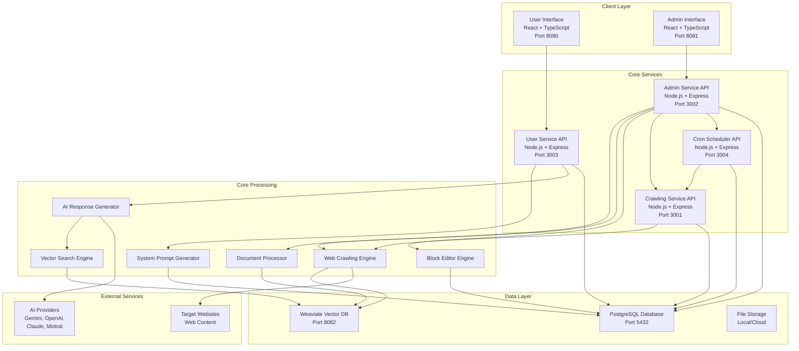

# CitadelAI Architecture (Community Edition)

This document provides a comprehensive overview of the CitadelAI Community Edition platform architecture.

## System Overview

CitadelAI Community Edition is an open-source AI chatbot platform designed for self-hosting. It consists of core services that work together to deliver intelligent, context-aware conversational experiences.

**Core Services**:
- User Service (Port 3003)
- Admin Service (Port 3002)
- Crawling Service (Port 3001)
- Cron Scheduler Service (Port 3004)

## High-Level Architecture

## Service Architecture

### 1. User Service (Port 3003)

**Purpose**: Handles user-facing chatbot interactions and authentication

**Technology Stack**:
- **Backend**: Node.js + Express + TypeScript
- **Database**: PostgreSQL with Prisma ORM
- **Authentication**: JWT tokens
- **Real-time**: Server-Sent Events (SSE)

### 2. Admin Service (Port 3002)

**Purpose**: Provides administrative interface for chatbot management and configuration

**Technology Stack**:
- **Backend**: Node.js + Express + TypeScript
- **Database**: PostgreSQL with Prisma ORM
- **Authentication**: JWT tokens
- **File Processing**: Multer for document uploads

### 3. Crawling Service (Port 3001)

**Purpose**: Handles web crawling and content indexing for knowledge integration

**Technology Stack**:
- **Backend**: Node.js + Express + TypeScript
- **Web Scraping**: Puppeteer
- **Vector Storage**: Weaviate
- **Parallelization**: Custom job queue

### 4. Cron Scheduler Service (Port 3004)

**Purpose**: Manages scheduled crawling tasks

**Technology Stack**:
- **Backend**: Node.js + Express + TypeScript
- **Scheduling**: node-cron

## Service Communication Patterns

All services communicate directly via HTTP using Docker service names.

### 1. Direct HTTP Communication

**User Frontend → User Backend**:
- Direct HTTP requests to `http://user-backend:3003`

**Admin Frontend → Admin Backend**:
- Direct HTTP requests to `http://admin-backend:3002`

**Admin Backend → Crawling Service**:
- Direct HTTP requests to `http://crawling-service:3001`

**Admin Backend → Cron Scheduler**:
- Direct HTTP requests to `http://cron-scheduler:3002`

**Cron Scheduler → Crawling Service**:
- Direct HTTP requests to `http://crawling-service:3001`

### 2. Database Communication

**All Services → PostgreSQL**:
- Direct database connections via Prisma ORM

**User Backend & Crawling Service → Weaviate**:
- Direct HTTP requests to `http://weaviate:8080`

## Deployment Architecture

### Community Deployment (`docker-compose.yml`)
- Core services only
- No proprietary features
- Direct service communication

---
*This architecture document reflects the Community Edition of the CitadelAI platform.*
