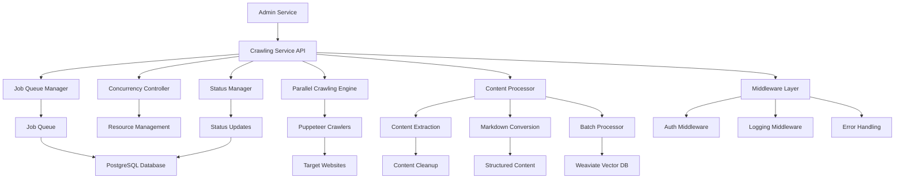
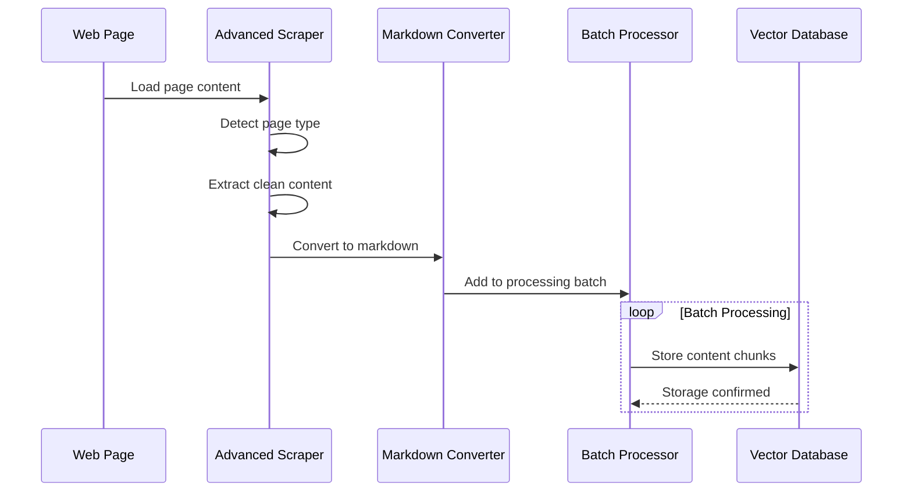
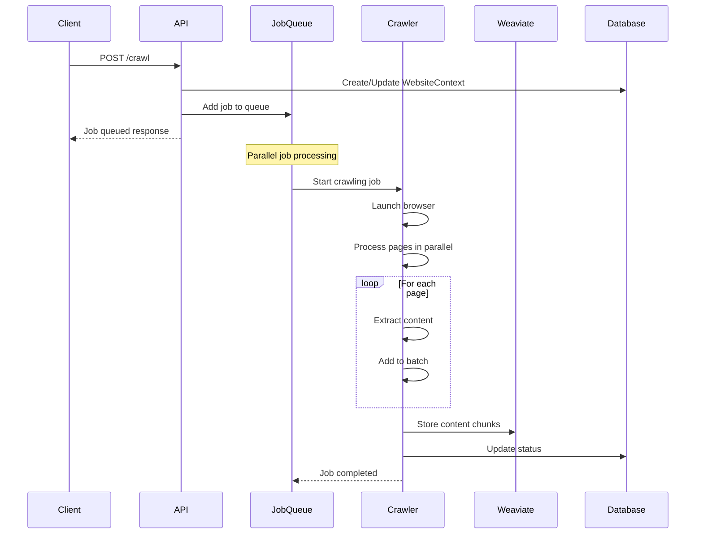
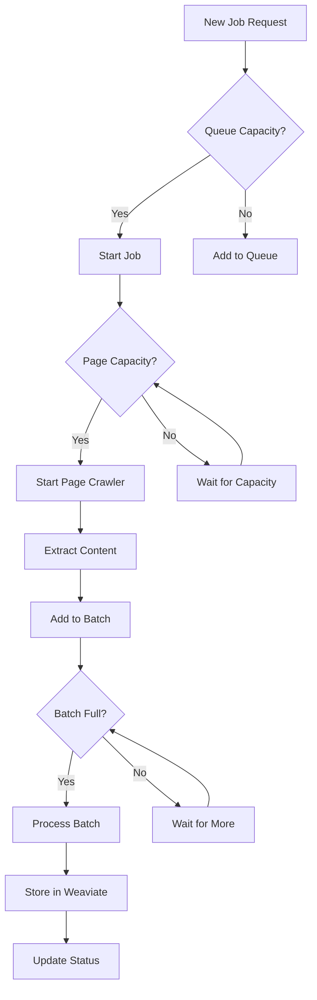

# Crawling Service Documentation

The Crawling Service is a high-performance, parallelized Node.js application responsible for all web crawling tasks in the CitadelAI platform. It features advanced parallelization logic, intelligent content processing, and sophisticated job management to efficiently crawl and index web content for AI context.

## Overview

**Service**: Crawling Service  
**Port**: 3001  
**Technology**: Node.js + Express + TypeScript  
**Database**: PostgreSQL with Prisma ORM  
**Vector Storage**: Weaviate for semantic search  
**Web Scraping**: Puppeteer for browser automation  
**Parallelization**: Custom job queue with multi-level concurrency controls (4 jobs × 5 pages = 20 concurrent operations)  

## Integration with AI Pipeline

The Crawling Service plays a crucial role in the CitadelAI ecosystem:

- **Content Indexing**: Crawled content is vectorized and stored in Weaviate for semantic search
- **Real-time Context**: The User Service retrieves relevant context from crawled content for AI responses
- **Fresh Content**: Scheduled crawling ensures AI responses are based on up-to-date information
- **System Prompt Integration**: Crawled content enhances system prompts with current knowledge
- **Knowledge Base**: Provides the foundation for intelligent, context-aware AI responses

## Architecture

### Service Components



### Key Features

- **Multi-level Parallelization**: Job-level, page-level, and content processing parallelization
- **Intelligent Content Extraction**: Advanced page type detection and content processing
- **Batch Processing**: Optimized content processing with intelligent batching
- **Real-time Status Updates**: Live progress tracking and concurrency monitoring
- **Advanced Error Handling**: Comprehensive retry logic and graceful degradation
- **Resource Management**: Efficient browser instance and memory management
- **Vector Integration**: Direct Weaviate integration for content indexing
- **Health Monitoring**: Comprehensive health checks and performance metrics

## Parallelization Architecture

### Multi-Level Concurrency

The service implements sophisticated parallelization at multiple levels:

#### 1. Job-Level Parallelization
- **Concurrent Jobs**: Up to 4 websites can be crawled simultaneously
- **Job Isolation**: Each job runs independently with its own resources
- **Dynamic Scaling**: Jobs are started/stopped based on available capacity
- **Resource Allocation**: Independent resource allocation per job

#### 2. Page-Level Parallelization
- **Concurrent Pages**: Up to 5 pages per website can be processed simultaneously
- **Resource Management**: Browser instances are shared efficiently across pages
- **Load Balancing**: Pages are distributed across available crawler instances
- **Queue Management**: Intelligent page queuing and distribution

#### 3. Content Processing Parallelization
- **Batch Processing**: Content is processed in batches of 5 items
- **Async Storage**: Weaviate storage operations run asynchronously
- **Queue Management**: Intelligent queuing prevents memory overflow
- **Memory Optimization**: Efficient memory usage and garbage collection

### Concurrency Controls

```typescript
interface ConcurrencyConfig {
  maxConcurrentJobs: 4;           // Maximum websites crawling simultaneously
  maxCrawlersPerJob: 5;           // Maximum pages per website
  maxTotalCrawlers: 20;           // Total system capacity (4 × 5)
  batchSize: 5;                   // Content processing batch size
  batchTimeout: 30000;            // Batch flush timeout (30s)
  queueMaxSize: 1000;             // Maximum queue size
  retryAttempts: 3;               // Maximum retry attempts
  retryDelay: 5000;               // Delay between retries (5s)
}
```

### Performance Optimizations

#### 1. Intelligent Batching
- **Content Batching**: Groups content for efficient Weaviate storage
- **Timeout-Based Flushing**: Ensures timely processing of small batches
- **Memory Management**: Prevents memory overflow with queue limits
- **Batch Optimization**: Dynamic batch sizing based on content size

#### 2. Advanced Content Extraction
- **Smart Scraping**: Detects page types and applies appropriate strategies
- **Lazy Loading**: Handles infinite scroll and dynamic content
- **Content Cleanup**: Removes ads, navigation, and irrelevant content
- **Page Type Detection**: Specialized handling for different website types

#### 3. Resource Optimization
- **Browser Reuse**: Efficient browser instance management
- **Connection Pooling**: Optimized database connections
- **Memory Management**: Automatic cleanup and garbage collection
- **CPU Optimization**: Efficient CPU usage and load balancing

## API Endpoints

### Primary Endpoints

#### Start Crawling Job (Optimized)
```http
POST /crawl
Content-Type: application/json

{
  "url": "https://example.com",
  "chatbotId": "chatbot-456",
  "blockId": "block-789",
  "recursive": true,
  "maxDepth": 3
}
```

**Response**:
```json
{
  "message": "Optimized crawling job added to the queue",
  "jobId": "job-123",
  "estimatedTime": "5-10 minutes"
}
```

#### Start Crawling Job (Legacy)
```http
POST /crawl-legacy
Content-Type: application/json

{
  "url": "https://example.com",
  "chatbotId": "chatbot-456",
  "blockId": "block-789",
  "recursive": false,
  "maxDepth": 1
}
```

**Response**:
```json
{
  "message": "Legacy crawling job added to the queue",
  "jobId": "job-124"
}
```

#### Get Crawling Status
```http
GET /status/:blockId
```

**Response**:
```json
{
  "status": "crawling",
  "progress": 5,
  "total": 10,
  "currentUrl": "https://example.com/page5",
  "pagesProcessed": 5,
  "pagesRemaining": 5,
  "estimatedTimeRemaining": "2 minutes",
  "startedAt": "2025-01-01T10:00:00Z",
  "lastUpdate": "2025-01-01T10:05:00Z"
}
```

#### Stop Crawling Job
```http
POST /stop
Content-Type: application/json

{
  "chatbotId": "chatbot-456",
  "blockId": "block-789"
}
```

**Response**:
```json
{
  "message": "Crawling stopped for block",
  "blockId": "block-789",
  "stoppedAt": "2025-01-01T10:05:00Z"
}
```

#### Health Check
```http
GET /health
```

**Response**:
```json
{
  "status": "healthy",
  "timestamp": "2025-01-01T10:00:00Z",
  "version": "1.0.0",
  "uptime": "2h 30m 15s"
}
```

#### Get Concurrency Status
```http
GET /concurrency-status
```

**Response**:
```json
{
  "maxConcurrentJobs": 4,
  "maxCrawlersPerJob": 5,
  "maxTotalCrawlers": 20,
  "activeJobsCount": 2,
  "totalActiveCrawlers": 8,
  "queueLength": 1,
  "memoryUsage": "45%",
  "cpuUsage": "23%",
  "activeJobs": [
    {
      "jobKey": "chatbot-456-block-789",
      "chatbotId": "chatbot-456",
      "blockId": "block-789",
      "startUrl": "https://example.com",
      "activeCrawlers": 4,
      "maxCrawlersPerJob": 5,
      "pagesProcessed": 12,
      "pagesRemaining": 8,
      "startedAt": "2025-01-01T10:00:00Z"
    }
  ],
  "queue": [
    {
      "chatbotId": "chatbot-789",
      "blockId": "block-101",
      "startUrl": "https://another-site.com",
      "queuedAt": "2025-01-01T10:05:00Z"
    }
  ]
}
```

## Advanced Crawling Features

### Intelligent Content Extraction

The service includes an `AdvancedScraper` class that handles complex web content:

#### Page Type Detection
- **Single Page Applications**: Detects React, Vue, Angular apps
- **Social Media**: Specialized handling for Reddit, Twitter, LinkedIn
- **E-commerce**: Optimized for product listings and catalogs
- **Notion Pages**: Special handling for Notion documentation
- **Blog Posts**: Optimized for article content extraction
- **Documentation**: Specialized for technical documentation

#### Content Loading Strategies
- **Infinite Scroll**: Automatically scrolls to load all content
- **Lazy Loading**: Waits for dynamic content to load
- **Load More Buttons**: Clicks buttons to reveal additional content
- **Content Stability**: Ensures content is fully loaded before extraction
- **Dynamic Content**: Handles JavaScript-rendered content
- **Form Interactions**: Fills forms and handles user interactions

### Content Processing Pipeline



### Error Handling and Resilience

#### Retry Logic
- **Browser Launch**: Up to 3 retries with exponential backoff
- **Page Loading**: Up to 2 retries per page with delays
- **Content Processing**: Graceful handling of processing failures
- **Network Issues**: Automatic retry for network-related failures
- **Rate Limiting**: Intelligent rate limiting and backoff

#### Graceful Degradation
- **Missing Context**: Continues crawling if WebsiteContext is deleted
- **Partial Failures**: Processes successful pages even if some fail
- **Resource Cleanup**: Ensures browser instances are properly closed
- **Status Updates**: Maintains accurate status even during failures
- **Memory Management**: Automatic memory cleanup and garbage collection

## Implementation Details

### Service Classes

#### 1. OptimizedCrawlingService (Default)
- **Primary Implementation**: Most efficient and feature-rich
- **Parallel Processing**: Multi-level concurrency controls
- **Batch Processing**: Intelligent content batching
- **Resource Management**: Advanced browser and memory management
- **Performance Monitoring**: Real-time performance metrics
- **Error Recovery**: Comprehensive error handling and recovery

#### 2. ParallelCrawlingService (Alternative)
- **Alternative Implementation**: Different parallelization approach
- **Content Queue**: Separate content processing queue
- **Background Processing**: Asynchronous content processing
- **Performance Focus**: Optimized for high-throughput scenarios
- **Memory Efficiency**: Optimized memory usage patterns

#### 3. CrawlingService (Legacy)
- **Fallback Implementation**: Original sequential implementation
- **Compatibility**: Maintains backward compatibility
- **Simple Architecture**: Easier to understand and debug
- **Resource Efficient**: Lower resource usage for small-scale crawling
- **Debugging**: Easier debugging and troubleshooting

### Database Schema

#### WebsiteContext Table
```sql
CREATE TABLE website_context (
  id TEXT PRIMARY KEY,
  chatbot_id TEXT NOT NULL,
  block_id TEXT UNIQUE NOT NULL,
  url TEXT NOT NULL,
  recursive BOOLEAN DEFAULT FALSE,
  max_depth INTEGER DEFAULT 3,
  crawling_status JSONB,
  last_crawled_at TIMESTAMP,
  crawled_pages_count INTEGER,
  cron_enabled BOOLEAN DEFAULT FALSE,
  cron_schedule TEXT,
  cron_timezone TEXT DEFAULT 'UTC',
  next_crawl_at TIMESTAMP,
  created_at TIMESTAMP DEFAULT NOW(),
  updated_at TIMESTAMP DEFAULT NOW()
);
```

#### Crawling Status Format
```json
{
  "status": "crawling|completed|error|queued|starting|stopped",
  "progress": 5,
  "total": 10,
  "currentUrl": "https://example.com/page5",
  "pagesProcessed": 5,
  "pagesRemaining": 5,
  "estimatedTimeRemaining": "2 minutes",
  "startedAt": "2025-01-01T10:00:00Z",
  "lastUpdate": "2025-01-01T10:05:00Z",
  "error": "Error message if status is error"
}
```

### Weaviate Integration

#### Schema Definition
```json
{
  "class": "WebsiteContent",
  "vectorizer": "text2vec-openai",
  "properties": [
    {
      "name": "chatbotId",
      "dataType": ["string"]
    },
    {
      "name": "blockId", 
      "dataType": ["string"]
    },
    {
      "name": "url",
      "dataType": ["string"]
    },
    {
      "name": "content",
      "dataType": ["text"]
    },
    {
      "name": "metadata",
      "dataType": ["object"]
    },
    {
      "name": "crawledAt",
      "dataType": ["date"]
    }
  ]
}
```

#### Content Chunking
- **Chunk Size**: 4000 characters per chunk
- **Parallel Storage**: All chunks stored simultaneously
- **Metadata Preservation**: URL and source information maintained
- **Vectorization**: Automatic vectorization for semantic search
- **Deduplication**: Content deduplication and optimization

## Flow Diagrams

### Optimized Crawling Flow


### Concurrency Management Flow


## Configuration and Tuning

### Environment Variables
```bash
# Required
OPENAI_API_KEY=your_openai_key
DATABASE_URL=postgresql://...

# Optional
PORT=3001
MAX_CONCURRENT_JOBS=4
MAX_CRAWLERS_PER_JOB=5
BATCH_SIZE=5
BATCH_TIMEOUT=30000
QUEUE_MAX_SIZE=1000
RETRY_ATTEMPTS=3
RETRY_DELAY=5000
WEAVIATE_URL=http://weaviate:8080
```

### Performance Tuning

#### Concurrency Settings
- **maxConcurrentJobs**: Adjust based on server resources
- **maxCrawlersPerJob**: Balance between speed and resource usage
- **batchSize**: Optimize for Weaviate performance
- **batchTimeout**: Balance between latency and throughput

#### Resource Management
- **Memory Usage**: Monitor and adjust queue sizes
- **CPU Usage**: Balance concurrency with available cores
- **Network**: Consider bandwidth limitations
- **Storage**: Monitor Weaviate storage growth

## Troubleshooting

### Common Issues

#### High Memory Usage
- **Cause**: Large content batches or memory leaks
- **Solution**: Reduce batch size, check for memory leaks
- **Monitoring**: Use `/concurrency-status` endpoint

#### Slow Crawling
- **Cause**: Network issues or complex pages
- **Solution**: Adjust timeouts, check page complexity
- **Monitoring**: Check page processing logs

#### Weaviate Errors
- **Cause**: Storage issues or schema problems
- **Solution**: Check Weaviate health, verify schema
- **Monitoring**: Monitor Weaviate logs

#### Browser Launch Failures
- **Cause**: Resource constraints or Puppeteer issues
- **Solution**: Check system resources, update Puppeteer
- **Monitoring**: Monitor browser launch logs

### Debugging Tools

#### Log Analysis
- **Job Logs**: Track job lifecycle and errors
- **Page Logs**: Monitor individual page processing
- **Performance Logs**: Analyze timing and bottlenecks
- **Error Logs**: Detailed error information and stack traces

#### Status Monitoring
- **Real-time Status**: Use concurrency status endpoint
- **Database Queries**: Check WebsiteContext table
- **Weaviate Queries**: Verify content storage
- **Resource Monitoring**: CPU, memory, and network usage

## Performance Monitoring

### Key Metrics

**Crawling Performance**:
- **Pages Per Minute**: Crawling throughput
- **Success Rate**: Percentage of successful page extractions
- **Error Rate**: Percentage of failed operations
- **Average Processing Time**: Time per page processing

**System Performance**:
- **Memory Usage**: RAM consumption and garbage collection
- **CPU Usage**: CPU utilization and load
- **Network Usage**: Bandwidth consumption
- **Database Performance**: Query execution times

**Concurrency Metrics**:
- **Active Jobs**: Number of currently running jobs
- **Active Crawlers**: Number of pages being processed
- **Queue Length**: Number of jobs waiting
- **Resource Utilization**: CPU and memory usage per job

### Monitoring Tools

**Built-in Monitoring**:
- **Health Check Endpoint**: Service health status
- **Concurrency Status**: Real-time concurrency information
- **Performance Metrics**: Built-in performance tracking
- **Error Tracking**: Comprehensive error logging

**External Monitoring**:
- **Application Metrics**: Custom metrics collection
- **Log Aggregation**: Centralized logging
- **Alerting**: Proactive alerting for issues
- **Dashboards**: Real-time monitoring dashboards

## Future Enhancements

### Planned Features
1. **Dynamic Scaling**: Automatic adjustment of concurrency based on load
2. **Content Deduplication**: Remove duplicate content across pages
3. **Advanced Filtering**: More sophisticated content filtering
4. **Performance Analytics**: Detailed performance metrics and reporting
5. **Content Versioning**: Track content changes over time
6. **Machine Learning**: AI-powered content extraction optimization

### Integration Improvements
1. **Real-time Updates**: WebSocket-based status updates
2. **Content Preview**: Preview crawled content before processing
3. **Custom Extractors**: Plugin system for custom content extraction
4. **Multi-format Support**: Support for additional content formats
5. **API Rate Limiting**: Intelligent rate limiting for external APIs
6. **Content Caching**: Intelligent content caching and reuse

---

*This documentation is maintained alongside the codebase and reflects the current state of the Crawling Service. For implementation details, refer to the source code in `crawling-service/src/`.*