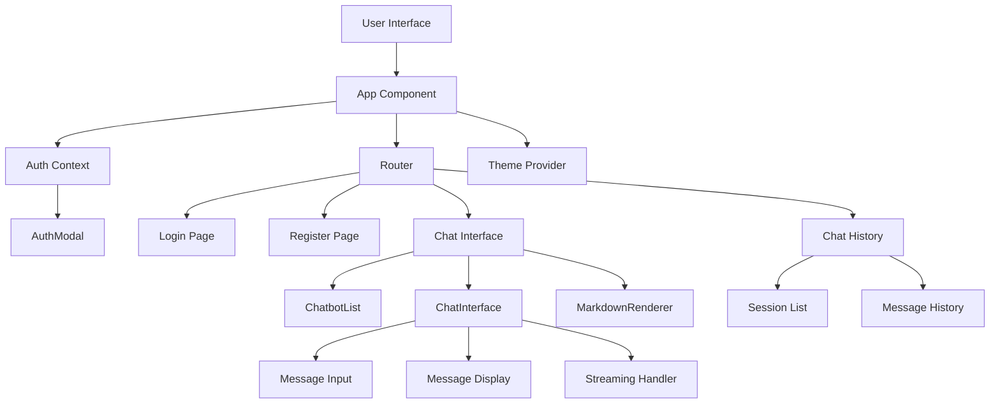
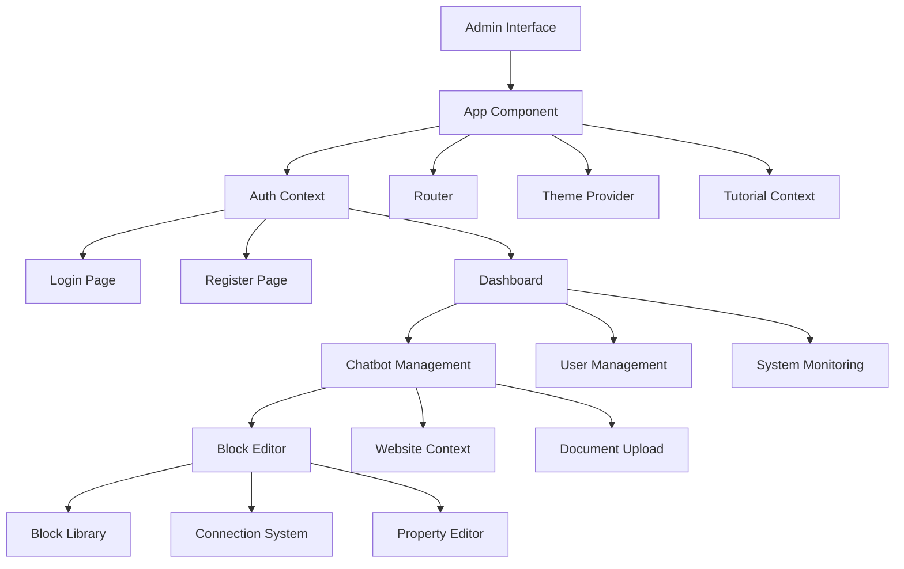

# Frontend Interfaces Documentation

The CitadelAI platform includes two comprehensive frontend interfaces: the User Interface for end users and the Admin Interface for administrators. Both interfaces are built with React, TypeScript, and modern web technologies to provide intuitive and responsive user experiences.

## Overview

### User Interface (Port 8080)
**Purpose**: End-user chatbot interaction interface  
**Technology**: React + TypeScript + Vite  
**Target Users**: End users interacting with chatbots  
**Key Features**: Real-time chat, message history, chatbot selection  

### Admin Interface (Port 8081)
**Purpose**: Administrative chatbot management interface  
**Technology**: React + TypeScript + Vite  
**Target Users**: Administrators managing chatbots  
**Key Features**: Visual block editor, user management, crawling configuration  

## User Interface

### Architecture



### Key Components

#### 1. Authentication System

**AuthModal Component**:
```typescript
interface AuthModalProps {
  isOpen: boolean;
  onClose: () => void;
  mode: 'login' | 'register';
  onSuccess: (user: User) => void;
}
```

**Features**:
- **Modal Interface**: Clean, focused authentication experience
- **Form Validation**: Real-time input validation
- **Error Handling**: User-friendly error messages
- **Responsive Design**: Mobile and desktop optimized

#### 2. Chat Interface

**ChatInterface Component**:
```typescript
interface ChatInterfaceProps {
  chatbotId: string;
  sessionId?: string;
  onSessionCreate: (session: ChatSession) => void;
  onSessionUpdate: (session: ChatSession) => void;
}
```

**Features**:
- **Real-time Streaming**: Server-Sent Events (SSE) integration
- **Message History**: Persistent conversation storage
- **Markdown Rendering**: Rich text message display
- **Typing Indicators**: Visual feedback during AI responses
- **Message Actions**: Copy, share, and manage messages

#### 3. Chatbot Selection

**ChatbotList Component**:
```typescript
interface ChatbotListProps {
  chatbots: Chatbot[];
  selectedChatbotId?: string;
  onSelect: (chatbot: Chatbot) => void;
  onSetDefault: (chatbotId: string) => void;
}
```

**Features**:
- **Available Chatbots**: List of accessible chatbots
- **Default Selection**: Quick access to default chatbot
- **Status Indicators**: Active/inactive status display
- **Search and Filter**: Find specific chatbots

#### 4. Message Rendering

**MarkdownRenderer Component**:
```typescript
interface MarkdownRendererProps {
  content: string;
  className?: string;
  enableLinks?: boolean;
  enableCodeHighlighting?: boolean;
}
```

**Features**:
- **Markdown Support**: Full markdown syntax support
- **Code Highlighting**: Syntax highlighting for code blocks
- **Link Handling**: Safe external link handling
- **Citation Support**: Source reference formatting
- **Custom Styling**: Consistent visual design

### Real-time Features

#### Server-Sent Events (SSE)

**Streaming Implementation**:
```typescript
const useStreamingChat = (chatbotId: string) => {
  const [messages, setMessages] = useState<Message[]>([]);
  const [isStreaming, setIsStreaming] = useState(false);
  
  const sendMessage = async (content: string) => {
    const eventSource = new EventSource(`/api/chat/respond-streaming`);
    
    eventSource.onmessage = (event) => {
      const data = JSON.parse(event.data);
      
      if (data.type === 'content') {
        // Update message content
        setMessages(prev => updateLastMessage(prev, data.content));
      } else if (data.type === 'citations') {
        // Add citations
        setMessages(prev => addCitations(prev, data.citations));
      } else if (data.type === 'followUps') {
        // Add follow-up suggestions
        setMessages(prev => addFollowUps(prev, data.followUps));
      } else if (data === '[DONE]') {
        // End streaming
        setIsStreaming(false);
        eventSource.close();
      }
    };
  };
};
```

**Streaming Features**:
- **Progressive Text**: Word-by-word message display
- **Real-time Updates**: Live message updates
- **Error Handling**: Graceful fallback to standard responses
- **Connection Management**: Automatic reconnection on failure

### State Management

#### Auth Context

```typescript
interface AuthContextType {
  user: User | null;
  isAuthenticated: boolean;
  isLoading: boolean;
  login: (email: string, password: string) => Promise<void>;
  register: (email: string, password: string, name: string) => Promise<void>;
  logout: () => Promise<void>;
  refreshUser: () => Promise<void>;
}
```

**Features**:
- **User State**: Current user information
- **Authentication Status**: Login/logout state
- **Token Management**: JWT token handling
- **Auto-refresh**: Automatic token refresh

#### Chat Context

```typescript
interface ChatContextType {
  currentSession: ChatSession | null;
  sessions: ChatSession[];
  messages: Message[];
  isLoading: boolean;
  sendMessage: (content: string) => Promise<void>;
  createSession: (chatbotId: string) => Promise<void>;
  deleteSession: (sessionId: string) => Promise<void>;
  setCurrentSession: (session: ChatSession) => void;
}
```

**Features**:
- **Session Management**: Active chat session
- **Message History**: Conversation messages
- **Session Persistence**: Local storage integration
- **Real-time Updates**: Live message updates

### UI Components

#### Custom Component Library

**Button Component**:
```typescript
interface ButtonProps {
  variant: 'primary' | 'secondary' | 'outline' | 'ghost';
  size: 'sm' | 'md' | 'lg';
  disabled?: boolean;
  loading?: boolean;
  onClick?: () => void;
  children: React.ReactNode;
}
```

**Input Component**:
```typescript
interface InputProps {
  type: 'text' | 'email' | 'password';
  placeholder?: string;
  value: string;
  onChange: (value: string) => void;
  error?: string;
  disabled?: boolean;
}
```

**Card Component**:
```typescript
interface CardProps {
  title?: string;
  description?: string;
  children: React.ReactNode;
  className?: string;
  onClick?: () => void;
}
```

### Responsive Design

#### Mobile Optimization

**Breakpoints**:
- **Mobile**: < 768px
- **Tablet**: 768px - 1024px
- **Desktop**: > 1024px

**Mobile Features**:
- **Touch-friendly**: Large touch targets
- **Swipe Gestures**: Swipe navigation
- **Mobile Menu**: Collapsible navigation
- **Optimized Layout**: Stack-based mobile layout

#### Desktop Features

**Desktop Optimization**:
- **Keyboard Shortcuts**: Power user features
- **Multi-window**: Multiple chat sessions
- **Drag & Drop**: File upload support
- **Advanced UI**: Rich desktop interface

## Admin Interface

### Architecture



### Key Components

#### 1. Dashboard

**Dashboard Component**:
```typescript
interface DashboardProps {
  stats: DashboardStats;
  recentChatbots: Chatbot[];
  systemStatus: SystemStatus;
  onRefresh: () => void;
}
```

**Features**:
- **System Overview**: Key metrics and statistics
- **Recent Activity**: Latest chatbot activity
- **Quick Actions**: Common administrative tasks
- **System Status**: Service health monitoring
- **Performance Metrics**: Real-time performance data

#### 2. Visual Block Editor

**BlockEditor Component**:
```typescript
interface BlockEditorProps {
  chatbot: Chatbot;
  onUpdate: (chatbot: Chatbot) => void;
  onSave: () => Promise<void>;
  onTest: () => void;
}
```

**Features**:
- **Drag & Drop**: Intuitive block placement
- **Visual Connections**: Flow-based chatbot design
- **Real-time Preview**: Live chatbot testing
- **Block Library**: Pre-built block components
- **Property Editor**: Block configuration interface

#### 3. Block Types

**System Prompt Block**:
```typescript
interface SystemPromptBlock {
  type: 'LOGIC';
  subtype: 'System Prompt';
  properties: {
    botName: string;
    companyName: string;
    behavior: 'helpful' | 'professional' | 'casual' | 'technical' | 'creative' | 'supportive';
    additionalInstructions: string;
    prompt: string;
  };
}
```

**Website Context Block**:
```typescript
interface WebsiteContextBlock {
  type: 'CONTEXT';
  subtype: 'Website Context';
  properties: {
    url: string;
    recursive: boolean;
    maxDepth: number;
    cronEnabled: boolean;
    cronSchedule?: string;
    cronTimezone: string;
  };
}
```

**Custom Interface Block**:
```typescript
interface CustomInterfaceBlock {
  type: 'FRONTEND';
  subtype: 'Custom Interface';
  properties: {
    title: string;
    description: string;
    theme: 'light' | 'dark' | 'auto';
    primaryColor: string;
    secondaryColor: string;
    logo?: string;
  };
}
```

#### 4. User Management

**UserManagement Component**:
```typescript
interface UserManagementProps {
  chatbotId: string;
  users: ChatbotAccess[];
  onAddUser: (email: string) => Promise<void>;
  onRemoveUser: (accessId: string) => Promise<void>;
  onUpdateAccess: (accessId: string, permissions: string[]) => Promise<void>;
}
```

**Features**:
- **User List**: Manage chatbot access
- **Invite Users**: Email-based user invitations
- **Permission Management**: Granular access control
- **Access History**: User access tracking
- **Bulk Operations**: Multiple user management

#### 5. Crawling Management

**CrawlingManagement Component**:
```typescript
interface CrawlingManagementProps {
  websiteContexts: WebsiteContext[];
  onStartCrawl: (context: WebsiteContext) => Promise<void>;
  onStopCrawl: (blockId: string) => Promise<void>;
  onUpdateSchedule: (blockId: string, schedule: CronSchedule) => Promise<void>;
}
```

**Features**:
- **Crawl Status**: Real-time crawling progress
- **Schedule Management**: Cron-based scheduling
- **Content Preview**: Preview crawled content
- **Performance Metrics**: Crawling performance data
- **Error Handling**: Crawling error management

### Advanced Features

#### 1. Tutorial System

**TutorialProvider**:
```typescript
interface TutorialContextType {
  currentStep: number;
  totalSteps: number;
  isCompleted: boolean;
  nextStep: () => void;
  previousStep: () => void;
  completeTutorial: () => void;
  skipTutorial: () => void;
}
```

**Features**:
- **Guided Onboarding**: Step-by-step tutorial
- **Interactive Hints**: Contextual help
- **Progress Tracking**: Tutorial completion status
- **Skip Option**: Optional tutorial skipping
- **Reset Capability**: Restart tutorial

#### 2. Real-time Monitoring

**SystemMonitoring Component**:
```typescript
interface SystemMonitoringProps {
  metrics: SystemMetrics;
  alerts: Alert[];
  onAcknowledgeAlert: (alertId: string) => void;
  onRefreshMetrics: () => void;
}
```

**Features**:
- **Performance Metrics**: Real-time system performance
- **Alert Management**: System alerts and notifications
- **Service Status**: Individual service health
- **Resource Usage**: CPU, memory, and disk usage
- **Historical Data**: Performance trend analysis

#### 3. Document Processing

**DocumentUpload Component**:
```typescript
interface DocumentUploadProps {
  chatbotId: string;
  blockId: string;
  onUpload: (file: File) => Promise<void>;
  onProgress: (progress: number) => void;
  onComplete: (document: Document) => void;
  onError: (error: string) => void;
}
```

**Features**:
- **File Upload**: Drag & drop file upload
- **Progress Tracking**: Upload progress indication
- **Format Support**: PDF, TXT, MD file support
- **Processing Status**: Real-time processing status
- **Error Handling**: Upload error management

### State Management

#### Block Editor Context

```typescript
interface BlockEditorContextType {
  chatbot: Chatbot;
  selectedBlock: Block | null;
  isDirty: boolean;
  updateBlock: (block: Block) => void;
  addBlock: (block: Omit<Block, 'id'>) => void;
  removeBlock: (blockId: string) => void;
  updateConnection: (connection: Connection) => void;
  removeConnection: (connectionId: string) => void;
  save: () => Promise<void>;
  test: () => Promise<void>;
}
```

**Features**:
- **Block Management**: CRUD operations for blocks
- **Connection Management**: Block relationship handling
- **Dirty State**: Unsaved changes tracking
- **Auto-save**: Automatic saving functionality
- **Undo/Redo**: Action history management

#### Tutorial Context

```typescript
interface TutorialContextType {
  currentStep: number;
  totalSteps: number;
  isCompleted: boolean;
  isActive: boolean;
  startTutorial: () => void;
  nextStep: () => void;
  previousStep: () => void;
  completeTutorial: () => void;
  skipTutorial: () => void;
}
```

**Features**:
- **Step Management**: Tutorial step navigation
- **Completion Tracking**: Tutorial progress
- **State Persistence**: Local storage integration
- **Customization**: Configurable tutorial steps

### UI/UX Features

#### 1. Design System

**Color Palette**:
```typescript
const colors = {
  primary: {
    50: '#eff6ff',
    500: '#3b82f6',
    900: '#1e3a8a'
  },
  secondary: {
    50: '#f8fafc',
    500: '#64748b',
    900: '#0f172a'
  },
  success: '#10b981',
  warning: '#f59e0b',
  error: '#ef4444',
  info: '#3b82f6'
};
```

**Typography**:
```typescript
const typography = {
  fontFamily: 'Inter, system-ui, sans-serif',
  fontSize: {
    xs: '0.75rem',
    sm: '0.875rem',
    base: '1rem',
    lg: '1.125rem',
    xl: '1.25rem',
    '2xl': '1.5rem',
    '3xl': '1.875rem'
  },
  fontWeight: {
    normal: 400,
    medium: 500,
    semibold: 600,
    bold: 700
  }
};
```

#### 2. Responsive Design

**Breakpoint System**:
```typescript
const breakpoints = {
  sm: '640px',
  md: '768px',
  lg: '1024px',
  xl: '1280px',
  '2xl': '1536px'
};
```

**Mobile Features**:
- **Touch Gestures**: Swipe, pinch, tap
- **Mobile Navigation**: Collapsible menu
- **Touch Targets**: Minimum 44px touch targets
- **Mobile Optimization**: Performance optimization

#### 3. Accessibility

**WCAG 2.1 Compliance**:
- **Keyboard Navigation**: Full keyboard support
- **Screen Reader**: ARIA labels and descriptions
- **Color Contrast**: WCAG AA contrast ratios
- **Focus Management**: Visible focus indicators
- **Semantic HTML**: Proper HTML semantics

**Accessibility Features**:
- **High Contrast Mode**: Enhanced visibility
- **Font Size Scaling**: User-configurable font sizes
- **Reduced Motion**: Respects user preferences
- **Voice Navigation**: Voice control support

### Performance Optimization

#### 1. Code Splitting

**Route-based Splitting**:
```typescript
const Dashboard = lazy(() => import('./pages/Dashboard'));
const ChatbotEditor = lazy(() => import('./pages/ChatbotEditor'));
const UserManagement = lazy(() => import('./pages/UserManagement'));
```

**Component Splitting**:
```typescript
const BlockEditor = lazy(() => import('./components/BlockEditor'));
const DocumentUpload = lazy(() => import('./components/DocumentUpload'));
const SystemMonitoring = lazy(() => import('./components/SystemMonitoring'));
```

#### 2. State Optimization

**Memoization**:
```typescript
const MemoizedBlockEditor = memo(BlockEditor, (prevProps, nextProps) => {
  return prevProps.chatbot.id === nextProps.chatbot.id &&
         prevProps.isDirty === nextProps.isDirty;
});
```

**Context Optimization**:
```typescript
const BlockEditorContext = createContext<BlockEditorContextType | null>(null);

const BlockEditorProvider = ({ children }: { children: React.ReactNode }) => {
  const value = useMemo(() => ({
    // Context value
  }), [chatbot, selectedBlock, isDirty]);
  
  return (
    <BlockEditorContext.Provider value={value}>
      {children}
    </BlockEditorContext.Provider>
  );
};
```

#### 3. Bundle Optimization

**Tree Shaking**:
- **ES Modules**: ES6 module imports
- **Dead Code Elimination**: Unused code removal
- **Minification**: Code minification
- **Compression**: Gzip/Brotli compression

**Asset Optimization**:
- **Image Optimization**: WebP format, lazy loading
- **Font Optimization**: Font subsetting, preloading
- **CSS Optimization**: Critical CSS, unused CSS removal
- **JavaScript Optimization**: Code splitting, minification

## Development & Testing

### Development Setup

**Prerequisites**:
- Node.js >= 18.0.0
- npm >= 8.0.0
- Backend services running

**Installation**:
```bash
# User Interface
cd user/interface
npm install
npm run dev

# Admin Interface
cd admin/interface
npm install
npm run dev
```

**Environment Variables**:
```bash
# User Interface
VITE_API_URL=http://localhost:3003
VITE_WS_URL=ws://localhost:3003

# Admin Interface
VITE_API_URL=http://localhost:3002
VITE_WS_URL=ws://localhost:3002
```

### Testing

**Test Types**:
- **Unit Tests**: Component and hook testing
- **Integration Tests**: API integration testing
- **E2E Tests**: Complete user flow testing
- **Visual Tests**: UI component testing

**Test Commands**:
```bash
npm test                    # Run all tests
npm run test:unit          # Unit tests only
npm run test:integration   # Integration tests only
npm run test:e2e           # E2E tests only
npm run test:coverage      # Coverage report
```

### Code Quality

**Linting**:
- **ESLint**: Code style and error detection
- **Prettier**: Code formatting
- **TypeScript**: Type checking
- **Husky**: Pre-commit hooks

**Code Standards**:
- **TypeScript**: Strict type checking
- **React Best Practices**: Modern React patterns
- **Component Design**: Reusable component design
- **Performance**: Performance optimization

## Deployment

### Build Configuration

**Vite Configuration**:
```typescript
export default defineConfig({
  plugins: [react()],
  build: {
    outDir: 'dist',
    sourcemap: true,
    rollupOptions: {
      output: {
        manualChunks: {
          vendor: ['react', 'react-dom'],
          ui: ['@radix-ui/react-dialog', '@radix-ui/react-dropdown-menu']
        }
      }
    }
  }
});
```

**Docker Configuration**:
```dockerfile
FROM node:18-alpine as builder
WORKDIR /app
COPY package*.json ./
RUN npm ci
COPY . .
RUN npm run build

FROM nginx:alpine
COPY --from=builder /app/dist /usr/share/nginx/html
COPY nginx.conf /etc/nginx/nginx.conf
EXPOSE 80
CMD ["nginx", "-g", "daemon off;"]
```

### Production Considerations

**Performance**:
- **CDN Integration**: Content delivery network
- **Caching**: Browser and server caching
- **Compression**: Gzip/Brotli compression
- **Minification**: Code and asset minification

**Security**:
- **HTTPS**: SSL/TLS encryption
- **CSP**: Content Security Policy
- **XSS Protection**: Cross-site scripting prevention
- **CSRF Protection**: Cross-site request forgery prevention

**Monitoring**:
- **Error Tracking**: Error monitoring and reporting
- **Performance Monitoring**: Real-time performance metrics
- **User Analytics**: User behavior tracking
- **Uptime Monitoring**: Service availability monitoring

---

*This documentation is maintained alongside the codebase and reflects the current state of the Frontend Interfaces. For implementation details, refer to the source code in `user/interface/src/` and `admin/interface/src/`.*