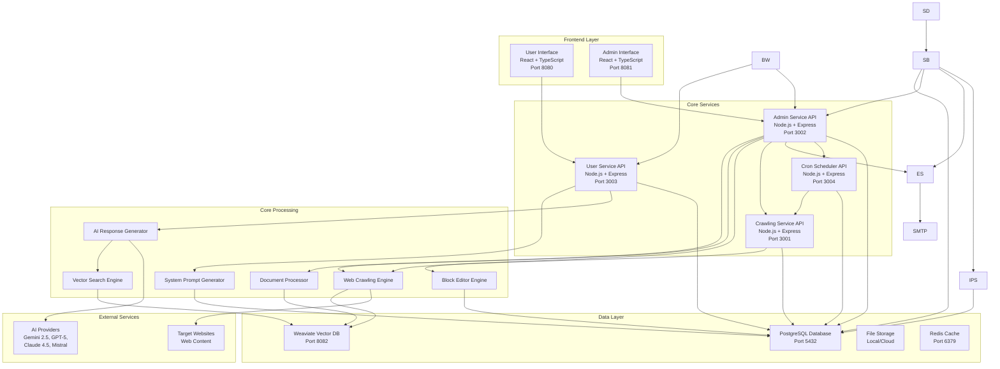

# CitadelAI Documentation

<div align="center">
  
</div>

Welcome to the comprehensive documentation for the CitadelAI platform. This documentation covers the complete AI-powered chatbot platform with advanced knowledge integration, real-time streaming, and intelligent content processing capabilities.

## 🎯 **Two Editions Available**

CitadelAI is available in two distinct editions, each tailored for different use cases and requirements:

### 🆓 **Community Edition (Open Source)**
- **Free and Open Source** under Apache 2.0 license
- **Core Features**: AI chatbot builder, web crawling, basic analytics
- **Perfect For**: Individuals, small teams, developers, open-source contributors
- **Deployment**: `docker-compose.opensource.yml`

### 💼 **Business Edition (Proprietary)**
- **Full-Featured Enterprise Solution** with advanced capabilities
- **Perfect For**: Businesses, organizations, enterprise users
- **Deployment**: `docker-compose.yml` or `docker-compose.hetzner.yml`

> 📖 **For detailed comparison**: See [Edition Comparison Guide](./EDITION_COMPARISON.md)

## Documentation Overview

### 🏗️ **System Architecture**
- **[Architecture Overview](./architecture.md)**: Complete system architecture including all services, data flows, and integration patterns
- **Key Features**: Microservices architecture, real-time communication, vector search integration, scalable design

### 🔧 **Service Documentation**

#### Core Services
- **[User Service](./user_service.md)**: End-user chatbot interactions, authentication, and real-time streaming
- **[Admin Service](./admin_service.md)**: Administrative interface for chatbot management and configuration
- **[Crawling Service](./crawling_service.md)**: Advanced web crawling with multi-level parallelization
- **[Cron Scheduler Service](./cron_scheduler_service.md)**: Scheduled crawling tasks and automated content updates

#### Frontend Interfaces
- **[Frontend Interfaces](./frontend_interfaces.md)**: User and Admin React interfaces with TypeScript
- **Key Features**: Real-time streaming, visual block editor, responsive design, and accessibility

### 🔌 **API Documentation**
- **[API Reference](./API_REFERENCE.md)**: Complete API documentation for all services
- **Key Features**: RESTful endpoints, real-time streaming, comprehensive error handling, and SDK examples

### 🚀 **Deployment & Development**
- **[Development Guide](./DEVELOPMENT.md)**: Development setup, code standards, and contribution guidelines
- **[Local Testing Guide](../LOCAL_TESTING_GUIDE.md)**: Optimized local testing setup
- **[Dedicated Instances](../DEDICATED_INSTANCES.md)**: Enterprise dedicated instance management
- **[Docker Compose Variants](../DOCKER_COMPOSE_VARIANTS.md)**: Guide to all deployment configurations

### 🧠 **AI & Knowledge Features**
- **[System Prompt Generation](./SYSTEM_PROMPT_GENERATION.md)**: Dynamic system prompt creation and configuration
- **[AI Pipeline Architecture](./AI_PIPELINE_ARCHITECTURE.md)**: How AI components work together in the platform
- **[Document Processing](./DOCUMENT_PROCESSING.md)**: PDF upload, processing, and vectorization

### 🎨 **User Experience**
- **[Frontend Authentication](./FRONTEND_AUTHENTICATION.md)**: User authentication and session management
- **[Registration Flow](./REGISTRATION_FLOW.md)**: User and admin registration processes
- **[Tutorial System](./TUTORIAL_SYSTEM.md)**: Guided onboarding and feature discovery

### 📊 **Operations & Monitoring**
- **[Performance Monitoring](./PERFORMANCE_MONITORING.md)**: Comprehensive monitoring and metrics guide
- **[Service Interaction Diagrams](./SERVICE_INTERACTION_DIAGRAMS.md)**: Visual service communication patterns

## Quick Start

### 1. **Choose Your Edition**
- **Community Edition**: [Get Started with Open Source](./EDITION_COMPARISON.md#community-edition-open-source)
- **Business Edition**: [Get Started with Enterprise](./EDITION_COMPARISON.md#business-edition-proprietary)

### 2. **System Overview**
Start with the [Architecture Overview](./architecture.md) to understand the complete system design and how all services work together.

### 3. **Service-Specific Setup**
Choose your area of focus:
- **End Users**: [User Service](./user_service.md) and [Frontend Interfaces](./frontend_interfaces.md)
- **Administrators**: [Admin Service](./admin_service.md) and [Frontend Interfaces](./frontend_interfaces.md)
- **Content Management**: [Crawling Service](./crawling_service.md) and [Cron Scheduler Service](./cron_scheduler_service.md)
- **AI Integration**: [System Prompt Generation](./SYSTEM_PROMPT_GENERATION.md) and [AI Pipeline Architecture](./AI_PIPELINE_ARCHITECTURE.md)

### 4. **Development Setup**
Follow the [Development Guide](./DEVELOPMENT.md) for local development setup and contribution guidelines.

### 5. **Deployment**
Use the [Deployment Guide](./DEPLOYMENT.md) for production deployment and configuration.

## Platform Features

### 🤖 **Intelligent AI Chatbots**
- **Dynamic System Prompts**: Context-aware prompt generation with real-time knowledge integration
- **Multiple Behavior Types**: Professional, casual, technical, creative, supportive, and analytical personas
- **Real-time Streaming**: Progressive text streaming with Server-Sent Events (SSE)
- **Citation Management**: Automatic source attribution and reference tracking

### 🕷️ **Advanced Web Crawling**
- **Multi-level Parallelization**: Job-level, page-level, and content processing parallelization
- **Intelligent Content Extraction**: Handles SPAs, social media, e-commerce, and complex web applications
- **Scheduled Crawling**: Automated content updates with cron-based scheduling
- **Content Optimization**: Advanced filtering, deduplication, and markdown conversion

### 🏗️ **Service Architecture**
- **Scalable Design**: Independent, containerized services with horizontal scaling
- **Service Isolation**: Separate user, admin, crawling, scheduling, email, and instance provisioning services
- **Database Integration**: PostgreSQL for structured data, Weaviate for vector search
- **Real-time Communication**: WebSocket and SSE support for live updates
- **Direct Service Communication**: Optimized architecture without API gateway overhead
- **Resilience Patterns**: Circuit breakers, retry logic, and health checks across services

### 🔧 **Admin Management**
- **Visual Block Editor**: Drag-and-drop interface for chatbot configuration
- **User Access Control**: Granular permissions and chatbot sharing
- **Performance Monitoring**: Real-time metrics and concurrency status
- **Tutorial System**: Guided onboarding and feature discovery
- **Two-Factor Authentication**: Enhanced security with 2FA support
- **Invitation Code Management**: Controlled user access with invitation codes

### 🛡️ **Resilience & Reliability**
- **Circuit Breaker**: Automatic failure detection and recovery
- **Health Checker**: Service health monitoring and status tracking
- **Metrics Collection**: Comprehensive performance and error metrics

## Architecture Highlights



## Performance Characteristics

| Component | Performance Target | Key Metrics |
|-----------|-------------------|-------------|
| System Prompt Generation | < 100ms | Response time, cache hit rate |
| Web Crawling | 60+ pages/min | Throughput, success rate |
| Vector Search | < 200ms | Query latency, accuracy |
| AI Response Generation | < 1.5s | Response time, streaming |
| Overall System | 99.95% uptime | Availability, error rate |

## Getting Started

### For Developers
1. **Read the Architecture**: Start with [Architecture Overview](./architecture.md)
2. **Set Up Development**: Follow [Development Guide](./DEVELOPMENT.md)
3. **Understand Services**: Review individual service documentation
4. **Deploy Locally**: Use [Local Testing Guide](../LOCAL_TESTING_GUIDE.md) or [Docker Compose Variants](../DOCKER_COMPOSE_VARIANTS.md)

### For Administrators
1. **Admin Interface**: [Frontend Interfaces](./frontend_interfaces.md)
2. **Service Management**: [Admin Service](./admin_service.md)
3. **Content Management**: [Crawling Service](./crawling_service.md)
4. **Scheduling**: [Cron Scheduler Service](./cron_scheduler_service.md)

### For End Users
1. **User Interface**: [Frontend Interfaces](./frontend_interfaces.md)
2. **Authentication**: [Frontend Authentication](./FRONTEND_AUTHENTICATION.md)
3. **Chat Features**: [User Service](./user_service.md)
4. **Registration**: [Registration Flow](./REGISTRATION_FLOW.md)

## API Integration

### Quick API Examples

**Send Message (Streaming)**:
```typescript
const response = await fetch('/api/chat/respond-streaming', {
  method: 'POST',
  headers: { 'Content-Type': 'application/json' },
  body: JSON.stringify({
    message: "What is the company's return policy?",
    chatSessionId: "session-123"
  })
});

// Handle Server-Sent Events
const reader = response.body.getReader();
// Process streaming response...
```

**Start Crawling Job**:
```typescript
const crawlJob = await fetch('/crawl', {
  method: 'POST',
  headers: { 'Content-Type': 'application/json' },
  body: JSON.stringify({
    url: "https://example.com",
    chatbotId: "chatbot-456",
    blockId: "block-789",
    recursive: true,
    maxDepth: 3
  })
});
```

## Documentation Structure

### 📁 **Service Documentation**
- **Backend Services**: Complete API documentation, data models, and implementation details
- **Frontend Services**: Component architecture, state management, and UI/UX guidelines
- **Integration Patterns**: How services communicate and work together

### 📁 **Operational Documentation**
- **Deployment**: Docker, Kubernetes, and production deployment guides
- **Development**: Local setup, code standards, and contribution guidelines
- **Monitoring**: Performance metrics, logging, and health checks

### 📁 **Feature Documentation**
- **AI Features**: System prompts, knowledge integration, and response generation
- **Crawling Features**: Web crawling, content processing, and scheduling
- **User Experience**: Authentication, registration, and tutorial systems

### 📁 **Edition-Specific Documentation**
- **[Community Edition](./COMMUNITY_EDITION.md)**: Open-source features and capabilities
- **[Business Edition](./BUSINESS_EDITION.md)**: Enterprise features and advanced capabilities
- **[Edition Comparison](./EDITION_COMPARISON.md)**: Detailed comparison between editions

## Support and Contributing

### Getting Help
- **Documentation**: Comprehensive guides for all aspects of the platform
- **API Reference**: Complete endpoint documentation with examples
- **Code Examples**: Extensive code samples and integration patterns

### Contributing
- **Development Guide**: Complete setup and contribution guidelines
- **Code Standards**: TypeScript, ESLint, and testing requirements
- **Pull Request Process**: Clear workflow for contributing changes

## Version Information

- **Documentation Version**: 2.3.0
- **Platform Version**: 1.9.2
- **Last Updated**: February 2026
- **Coverage**: Complete platform documentation with all services and deployment options
- **Recent Updates**: 
  - Resilience library with circuit breaker, health checker, and metrics
  - Two-Factor Authentication (2FA) implementation
  - Dedicated email service architecture
  - Responsive design improvements
  - Invitation code management
  - Enhanced billing system with trial period support
  - Multiple dependency updates (nodemailer 7.0.7, multer 2.0.2, glob 10.5.0, js-yaml 4.1.1)
  - Local testing optimizations (removed Kong/Event Bus)
  - Multiple deployment configurations
  - Business website documentation

## 📋 Changelog

See [CHANGELOG.md](../CHANGELOG.md) for detailed version history and recent changes.

---

For specific implementation details, refer to the individual documentation files. Each document provides comprehensive coverage of its respective component with examples, best practices, and troubleshooting guides.

