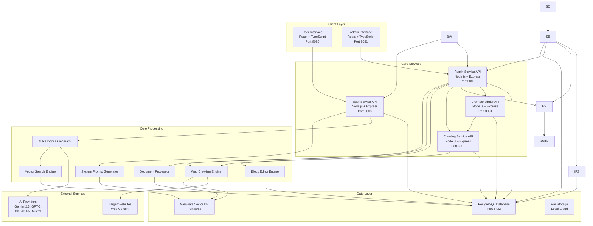
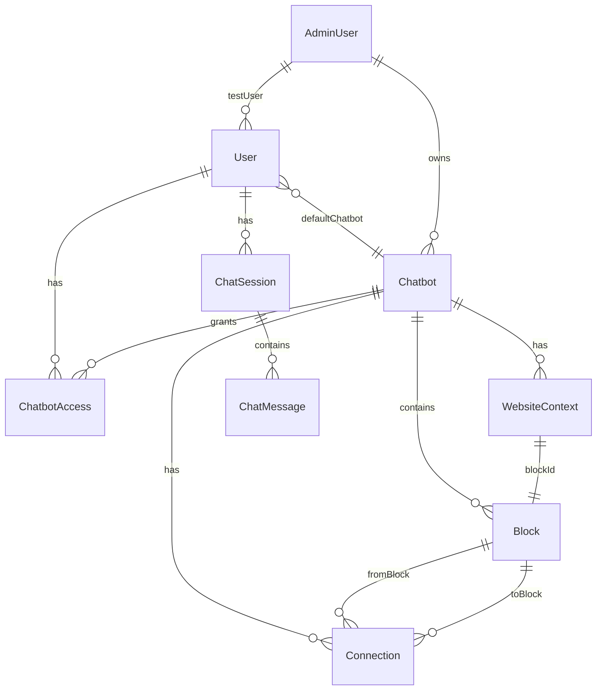
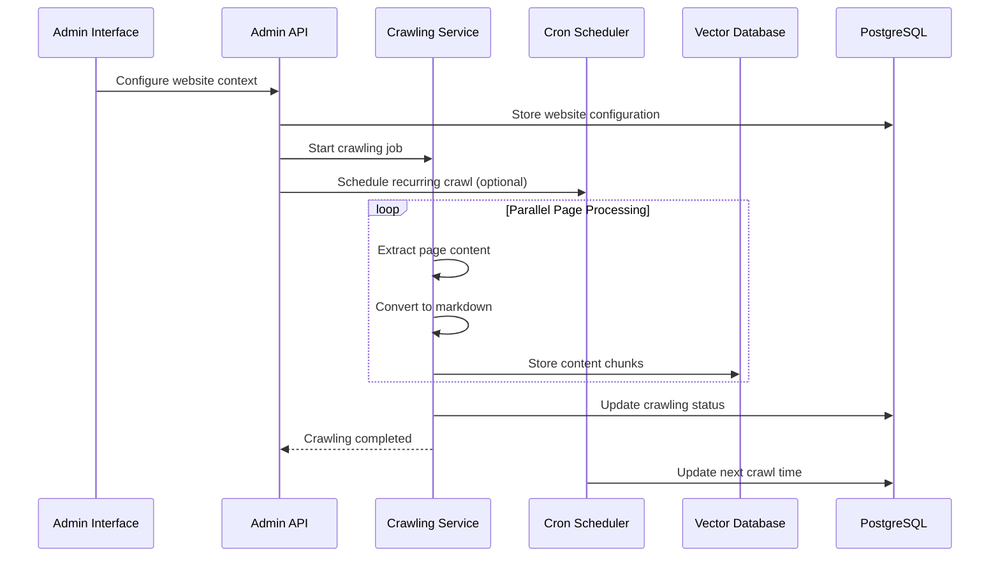
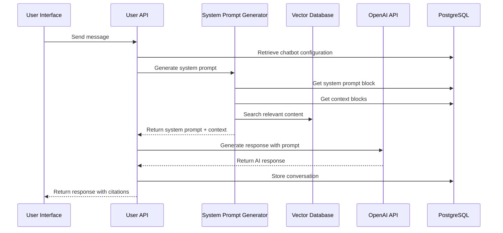
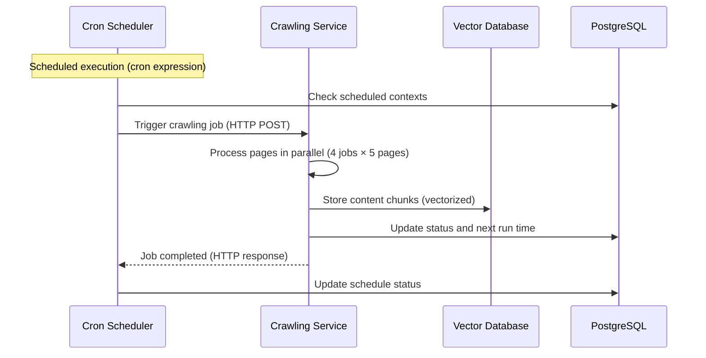

# CitadelAI Architecture

This document provides a comprehensive overview of the CitadelAI platform architecture, including all services, data flows, and integration patterns.

## System Overview

CitadelAI is an AI chatbot platform designed for scalability, maintainability, and high performance. Built to help not to replace, the platform consists of multiple core services that work together to deliver intelligent, context-aware conversational experiences.

**Core Services**:
- User Service (Port 3003)
- Admin Service (Port 3002)
- Crawling Service (Port 3001)
- Cron Scheduler Service (Port 3004)

## High-Level Architecture



## Service Architecture

### 1. User Service (Port 3003)

**Purpose**: Handles user-facing chatbot interactions and authentication

**Technology Stack**:
- **Backend**: Node.js + Express + TypeScript
- **Database**: PostgreSQL with Prisma ORM
- **Authentication**: JWT tokens
- **Real-time**: Server-Sent Events (SSE)

**Key Components**:
- **Auth Controller**: User registration, login, logout
- **Chat Controller**: Message handling, streaming responses
- **Chatbot Controller**: Chatbot access and management
- **Middleware**: Authentication, logging, error handling

**API Endpoints**:
```
POST /api/auth/register          # User registration
POST /api/auth/login             # User login
POST /api/auth/logout            # User logout
GET  /api/auth/me                # Get current user
POST /api/chat/respond           # Send message (standard)
POST /api/chat/respond-streaming # Send message (streaming)
GET  /api/chat/history           # Get chat history
GET  /api/chat/sessions          # Get chat sessions
POST /api/chat/sessions          # Create chat session
POST /api/chat/:id/title         # Generate chat title
DELETE /api/chat/:id             # Delete chat session
GET  /api/chatbots               # List accessible chatbots
GET  /api/chatbots/:id           # Get specific chatbot
POST /api/chatbots/:id/set-default # Set default chatbot
```

**Data Models**:
- `User`: User accounts and profiles
- `ChatSession`: Chat conversation sessions
- `ChatMessage`: Individual chat messages
- `ChatbotAccess`: User access to chatbots

### 2. Admin Service (Port 3002)

**Purpose**: Provides administrative interface for chatbot management and configuration

**Technology Stack**:
- **Backend**: Node.js + Express + TypeScript
- **Database**: PostgreSQL with Prisma ORM
- **Authentication**: JWT tokens with role-based access
- **File Processing**: Multer for document uploads

**Key Components**:
- **Auth Controller**: Admin registration, login, profile management
- **Chatbot Controller**: Chatbot CRUD operations
- **Block Controller**: Visual block editor management
- **Crawling Controller**: Web crawling job management
- **Document Controller**: Document processing and uploads
- **User Management**: User access control and permissions

**API Endpoints**:
```
# Authentication
POST /api/admin/auth/register              # Admin registration
POST /api/admin/auth/login                 # Admin login
GET  /api/admin/me                         # Get admin profile
PUT  /api/admin/profile                    # Update profile
PUT  /api/admin/change-password            # Change password
DELETE /api/admin/delete-account           # Delete account

# Dashboard
GET  /api/admin/dashboard/stats            # Dashboard statistics

# Chatbot Management
POST /api/admin/chatbots                   # Create chatbot
GET  /api/admin/chatbots                   # List chatbots
GET  /api/admin/chatbots/:id               # Get chatbot
PUT  /api/admin/chatbots/:id               # Update chatbot
DELETE /api/admin/chatbots/:id             # Delete chatbot
DELETE /api/admin/chatbots/:id/blocks/:blockId # Delete block

# User Access Management
GET  /api/admin/chatbots/:id/users         # List chatbot users
POST /api/admin/chatbots/:id/users         # Add user access
DELETE /api/admin/chatbots/:id/users/:accessId # Remove user access

# Crawling Management
POST /api/admin/crawl                      # Start crawling job
GET  /api/admin/status/:blockId            # Get crawling status
POST /api/admin/stop                       # Stop crawling job
POST /api/admin/cron/update                # Update cron settings

# Document Processing
POST /api/admin/documents/upload           # Upload document
GET  /api/admin/documents                  # List documents
DELETE /api/admin/documents/:id            # Delete document
```

**Data Models**:
- `AdminUser`: Admin accounts with roles and permissions
- `Chatbot`: Chatbot configurations and metadata
- `Block`: Visual block editor components
- `Connection`: Block relationships and flow
- `WebsiteContext`: Web crawling configurations
- `ChatbotAccess`: User access permissions

### 3. Crawling Service (Port 3001)

**Purpose**: Handles web crawling and content indexing for knowledge integration

**Technology Stack**:
- **Backend**: Node.js + Express + TypeScript
- **Web Scraping**: Puppeteer for browser automation
- **Database**: PostgreSQL with Prisma ORM
- **Vector Storage**: Weaviate for semantic search
- **Parallelization**: Custom job queue with concurrency controls

**Key Components**:
- **Crawling Engine**: Multi-level parallelized web crawling
- **Content Extractor**: Intelligent content extraction and processing
- **Batch Processor**: Optimized content batching and storage
- **Job Queue**: Advanced job management with concurrency controls
- **Status Manager**: Real-time crawling status and progress tracking

**API Endpoints**:
```
POST /crawl                    # Start optimized crawling job
POST /crawl-legacy             # Start legacy crawling job
GET  /status/:blockId          # Get crawling status
POST /stop                     # Stop crawling job
GET  /health                   # Health check
GET  /concurrency-status       # Get concurrency information
```

**Parallelization Architecture**:
- **Job Level**: Up to 4 websites crawling simultaneously
- **Page Level**: Up to 5 pages per website concurrently
- **Content Processing**: Batches of 5 content items
- **Total Capacity**: 4 × 5 = 20 concurrent operations

**Content Processing Pipeline**:
1. **Page Detection**: Identify page type (SPA, social media, e-commerce)
2. **Content Extraction**: Extract clean, relevant content
3. **Markdown Conversion**: Convert to structured markdown
4. **Chunking**: Split content into 4000-character chunks
5. **Vectorization**: Generate embeddings for semantic search
6. **Storage**: Store in Weaviate with metadata

### 4. Cron Scheduler Service (Port 3004)

**Purpose**: Manages scheduled crawling tasks and automated content updates

**Technology Stack**:
- **Backend**: Node.js + Express + TypeScript
- **Scheduling**: node-cron for cron job management
- **Database**: PostgreSQL with Prisma ORM
- **Timezone Support**: Full timezone handling for global deployments

**Key Components**:
- **Cron Scheduler**: Advanced cron job management
- **Timezone Handler**: Multi-timezone support
- **Job Trigger**: Automated crawling job initiation
- **Schedule Manager**: CRUD operations for schedules

**API Endpoints**:
```
POST /cron/update              # Update cron settings
GET  /cron/status/:blockId     # Get cron status
GET  /cron/scheduled           # List scheduled crawls
DELETE /cron/unschedule/:blockId # Unschedule task
GET  /health                   # Health check
```

**Scheduling Features**:
- **Cron Expressions**: Full cron syntax support
- **Timezone Support**: Global timezone handling
- **Next Run Calculation**: Accurate next execution time
- **Schedule Validation**: Cron expression validation
- **Automatic Cleanup**: Orphaned schedule cleanup

### 5. User Frontend (Port 8080)

**Purpose**: User-facing chatbot interface for end users

**Technology Stack**:
- **Frontend**: React + TypeScript + Vite
- **UI Components**: Custom component library
- **State Management**: React Context + Hooks
- **Real-time**: Server-Sent Events (SSE)
- **Styling**: CSS Modules + Tailwind CSS

**Key Components**:
- **AuthModal**: User authentication interface
- **ChatInterface**: Main chat interface with streaming
- **ChatbotList**: Available chatbots selection
- **ChatHistory**: Conversation history management
- **MarkdownRenderer**: Rich text message rendering

**Features**:
- **Real-time Streaming**: Progressive text display
- **Message History**: Persistent conversation storage
- **Chatbot Switching**: Multiple chatbot support
- **Responsive Design**: Mobile and desktop optimized
- **Accessibility**: WCAG 2.1 compliance

### 6. Admin Frontend (Port 8081)

**Purpose**: Administrative interface for chatbot management and configuration

**Technology Stack**:
- **Frontend**: React + TypeScript + Vite
- **UI Components**: Custom component library
- **State Management**: React Context + Hooks
- **Visual Editor**: Drag-and-drop block editor
- **Styling**: CSS Modules + Tailwind CSS

**Key Components**:
- **Dashboard**: System overview and statistics
- **Block Editor**: Visual chatbot configuration
- **User Management**: Access control interface
- **Crawling Management**: Web crawling configuration
- **Document Upload**: File processing interface
- **Tutorial System**: Guided onboarding

**Features**:
- **Visual Block Editor**: Drag-and-drop interface
- **Real-time Preview**: Live chatbot testing
- **User Management**: Granular access control
- **Performance Monitoring**: Real-time metrics
- **Tutorial System**: Interactive onboarding


**Purpose**: Centralized email sending service with SMTP integration

**Technology Stack**:
- **Backend**: Node.js + Express + TypeScript
- **Resilience**: Circuit breaker, retry logic, health checks

**Key Components**:
- **Health Monitor**: Connection verification and health checks
- **Error Handler**: Comprehensive error handling and timeouts

**Features**:
- **Centralized Email**: Single service for all email operations
- **Resilience**: Built-in retry logic and circuit breaker
- **Health Monitoring**: Connection verification endpoints
- **Attachment Support**: Email attachments support
- **Dual Format**: HTML and plain text email support

**API Endpoints**:
```
POST /api/email/send        # Send email
GET  /api/email/verify      # Verify SMTP connection
POST /api/email/test        # Send test email
GET  /health                # Health check
```

**Integration**:
- Used by Admin Service for verification emails, notifications
- Used by User Service for password reset, account updates


**Purpose**: Manages dedicated enterprise instances with isolated infrastructure

**Technology Stack**:
- **Backend**: Node.js + Express + TypeScript
- **Database**: PostgreSQL with Prisma ORM
- **Container Management**: Docker API integration

**Key Components**:
- **Instance Manager**: Docker container orchestration
- **Subdomain Manager**: DNS and routing configuration
- **Resource Manager**: CPU, memory, storage allocation
- **Health Monitor**: Instance status tracking

**Features**:
- **Dedicated Instances**: Complete isolation per enterprise
- **Resource Templates**: Predefined resource configurations
- **Health Monitoring**: Real-time instance status
- **Lifecycle Management**: Create, suspend, resume, delete

**API Endpoints**:
```
GET  /api/instances              # List all instances
GET  /api/instances/:id           # Get instance details
POST /api/instances               # Create new instance
POST /api/instances/:id/suspend   # Suspend instance
POST /api/instances/:id/resume    # Resume instance
DELETE /api/instances/:id         # Delete instance
GET  /api/health                 # Service health check
```


**Purpose**: Public-facing marketing and information website

**Technology Stack**:
- **Frontend**: React + TypeScript
- **Styling**: CSS Modules
- **SEO**: Meta tags and structured data
- **Internationalization**: Multi-language support

**Key Features**:
- **Marketing Pages**: Product information and features
- **SEO Optimization**: Search engine optimization
- **Responsive Design**: Mobile and desktop support
- **Multi-language**: Internationalization support
- **Contact Forms**: Lead generation
- **Analytics**: User tracking and metrics


**Purpose**: Super admin dashboard for system-wide management

**Technology Stack**:
- **Database**: PostgreSQL with Prisma ORM
- **Integration**: Direct service connections

**Key Features**:
- **System Administration**: Complete platform oversight
- **Resource Management**: Database and service management
- **User Management**: System-wide user administration
- **Instance Management**: Dedicated instance oversight

## Data Architecture

### Database Schema

The platform uses a unified PostgreSQL database with the following key entities:



**Core Entities**:

1. **User Management**:
   - `User`: End-user accounts
   - `AdminUser`: Administrative accounts
   - `ChatbotAccess`: User access permissions

2. **Chatbot Configuration**:
   - `Chatbot`: Chatbot metadata and settings
   - `Block`: Visual editor components
   - `Connection`: Block relationships and flow
   - `WebsiteContext`: Web crawling configurations

3. **Conversation Management**:
   - `ChatSession`: Chat conversation sessions
   - `ChatMessage`: Individual messages

4. **Scheduling**:
   - `WebsiteContext`: Cron scheduling settings
   - Next crawl time calculation
   - Timezone support

### Vector Database (Weaviate)

**Purpose**: Semantic search and content retrieval

**Schema**:
```json
{
  "class": "WebsiteContent",
  "vectorizer": "text2vec-openai",
  "properties": [
    {
      "name": "chatbotId",
      "dataType": ["string"]
    },
    {
      "name": "blockId",
      "dataType": ["string"]
    },
    {
      "name": "url",
      "dataType": ["string"]
    },
    {
      "name": "content",
      "dataType": ["text"]
    },
    {
      "name": "metadata",
      "dataType": ["object"]
    }
  ]
}
```

**Content Processing**:
- **Chunk Size**: 4000 characters per chunk
- **Vectorization**: OpenAI text-embedding-ada-002
- **Metadata**: URL, source, timestamp, chatbot ID
- **Search**: Semantic similarity search
- **Retrieval**: Top-k relevant chunks

## Data Flow Architecture

### 1. Content Ingestion Flow



### 2. AI Response Generation Flow



### 3. Scheduled Crawling Flow



## Service Communication Patterns

All services communicate directly via HTTP using Docker service names. There is no API Gateway, Service Mesh, or Event Bus in the standard deployment.

### 1. Direct HTTP Communication

**User Frontend → User Backend**:
- Direct HTTP requests to `http://user-backend:3003`
- Server-Sent Events (SSE) for streaming responses

**Admin Frontend → Admin Backend**:
- Direct HTTP requests to `http://admin-backend:3002`
- Real-time status updates via polling

**Admin Backend → Crawling Service**:
- Direct HTTP requests to `http://crawling-service:3001`
- Crawling job initiation and status monitoring

**Admin Backend → Cron Scheduler**:
- Direct HTTP requests to `http://cron-scheduler:3002`
- Schedule management and configuration

- Direct HTTP requests to `http://email-service:3008`
- Email sending with resilience (circuit breaker, retry logic)
- Used for verification emails, notifications, password resets

- Direct HTTP requests to `http://email-service:3008`
- Email sending for proposals, instance access, system notifications

- Direct HTTP requests to `http://admin-backend:3002`
- Admin API access for system management

- Direct HTTP requests to `http://instance-provisioning-service:3007`
- Instance lifecycle management

**Cron Scheduler → Crawling Service**:
- Direct HTTP requests to `http://crawling-service:3001` (via Kong:8000)
- Scheduled job triggering

### 2. Database Communication

**All Services → PostgreSQL**:
- Direct database connections via Prisma ORM
- Connection string: `postgresql://citadel_user:citadel_pass@db:5432/citadel_db`

**User Backend & Crawling Service → Weaviate**:
- Direct HTTP requests to `http://weaviate:8080`
- Vector operations and content indexing
- Semantic search for AI context retrieval

### 3. Real-time Communication

**User Frontend ↔ User Service**:
- Server-Sent Events (SSE) for progressive text streaming
- HTTP polling for status updates

**Admin Frontend ↔ Admin Service**:
- HTTP polling for real-time metrics
- WebSocket-like behavior via frequent polling

## Security Architecture

### Authentication & Authorization

**JWT Token Structure**:
```json
{
  "id": "user-id",
  "email": "user@example.com",
  "role": "USER|ADMIN",
  "iat": 1640995200,
  "exp": 1640998800
}
```

**Access Control**:
- **User Level**: Access to assigned chatbots
- **Admin Level**: Full platform access
- **Service Level**: Internal service communication
- **API Level**: Rate limiting and throttling

### Data Protection

**Encryption**:
- **In Transit**: HTTPS/TLS for all communications
- **At Rest**: Database encryption and secure storage
- **Passwords**: bcrypt hashing with salt
- **Tokens**: Secure JWT signing and validation

**Input Validation**:
- **API Inputs**: Comprehensive validation and sanitization
- **File Uploads**: Type and size validation
- **SQL Injection**: Prisma ORM protection
- **XSS Protection**: Input sanitization and output encoding

## Performance Architecture

### Caching Strategy

**Application Level**:
- **System Prompts**: Cached prompt generation
- **Chatbot Configs**: In-memory configuration cache
- **User Sessions**: Session state caching

**Database Level**:
- **Query Optimization**: Indexed queries and connection pooling
- **Read Replicas**: Read-only database replicas
- **Connection Pooling**: Efficient database connections

**CDN Level**:
- **Static Assets**: Frontend asset caching
- **API Responses**: Cached API responses
- **Content Delivery**: Global content distribution

### Scalability Patterns

**Horizontal Scaling**:
- **Service Replication**: Multiple service instances
- **Load Balancing**: Request distribution
- **Database Sharding**: Data partitioning
- **Microservices**: Independent service scaling

**Vertical Scaling**:
- **Resource Allocation**: CPU and memory optimization
- **Concurrency Tuning**: Parallel processing limits
- **Cache Sizing**: Memory cache optimization
- **Database Tuning**: Query and connection optimization

## Monitoring & Observability

### Metrics Collection

**Application Metrics**:
- **Response Times**: API endpoint performance
- **Error Rates**: Error frequency and types
- **Throughput**: Requests per second
- **Resource Usage**: CPU, memory, disk usage

**Business Metrics**:
- **Active Users**: Concurrent user count
- **Chat Sessions**: Conversation volume
- **Crawling Jobs**: Content processing volume
- **AI Responses**: Response generation metrics

### Logging Strategy

**Structured Logging**:
- **JSON Format**: Machine-readable log format
- **Log Levels**: DEBUG, INFO, WARN, ERROR
- **Context Information**: Request IDs, user IDs, timestamps
- **Correlation IDs**: Request tracing across services

**Log Aggregation**:
- **Centralized Logging**: Central log collection
- **Log Analysis**: Pattern recognition and alerting
- **Log Retention**: Configurable retention policies
- **Log Search**: Full-text search capabilities

### Health Monitoring

**Health Checks**:
- **Service Health**: Individual service status
- **Database Health**: Connection and query health
- **External Dependencies**: OpenAI, Weaviate health
- **Resource Health**: CPU, memory, disk monitoring

**Alerting**:
- **Threshold Alerts**: Performance threshold violations
- **Error Alerts**: Error rate and type alerts
- **Resource Alerts**: Resource usage alerts
- **Business Alerts**: Business metric alerts

## Deployment Architecture

### Container Strategy

**Docker Containers**:
- **Multi-stage Builds**: Optimized container images
- **Base Images**: Node.js Alpine for efficiency
- **Security Scanning**: Container vulnerability scanning
- **Image Registry**: Centralized container registry

**Container Orchestration**:
- **Docker Compose**: Development environment
- **Kubernetes**: Production orchestration
- **Service Discovery**: Automatic service discovery
- **Load Balancing**: Built-in load balancing

### Environment Management

**Environment Types**:
- **Development**: Local development environment
- **Staging**: Pre-production testing environment
- **Production**: Live production environment
- **Testing**: Automated testing environment

**Configuration Management**:
- **Environment Variables**: Service configuration
- **Secrets Management**: Secure secret storage
- **Feature Flags**: Runtime feature toggles
- **Configuration Validation**: Startup configuration checks

## Deployment Configurations

CitadelAI supports multiple deployment configurations optimized for different use cases:

### Standard Deployment (`docker-compose.yml`)
- Core services with direct HTTP communication
- PostgreSQL and Weaviate databases
- Suitable for production proprietary deployments
- No API Gateway, Service Mesh, or Event Bus

### Local Testing (`docker-compose.local.yml`)
- **Optimized Configuration**: Includes Redis caching
- Direct service communication (no Kong/Event Bus)
- Reduced resource usage compared to full microservices stack
- **See**: [Local Optimizations Summary](../LOCAL_OPTIMIZATIONS_SUMMARY.md)

### Open Source Deployment (`docker-compose.yml` in community edition)
- Core services only
- No proprietary features
- Community edition functionality
- Direct service communication

**Note**: All deployment configurations use direct service communication for simplified architecture and better performance. Services communicate via Docker service names (e.g., `http://crawling-service:3001`).

## Future Architecture Evolution

### Planned Enhancements

**Advanced Patterns**:
- **Saga Pattern**: Distributed transaction management
- **Outbox Pattern**: Reliable event publishing
- **Event Streaming**: Apache Kafka integration (future)
- **Multi-tenant Architecture**: Better resource isolation

**Scalability Improvements**:
- **Auto-scaling**: Dynamic resource allocation
- **Multi-region**: Global deployment support
- **Edge Computing**: CDN and edge processing
- **Serverless**: Function-as-a-Service integration

**Technology Upgrades**:
- **GraphQL API**: More flexible API layer
- **Real-time Updates**: WebSocket integration
- **Advanced Analytics**: Machine learning insights
- **Multi-tenant**: Better resource isolation

### Integration Roadmap

**External Integrations**:
- **CRM Systems**: Salesforce, HubSpot integration
- **Analytics**: Google Analytics, Mixpanel
- **Monitoring**: Datadog, New Relic
- **Security**: Auth0, Okta integration

**AI Enhancements**:
- **Multi-model Support**: Multiple AI providers
- **Custom Models**: Fine-tuned models
- **Advanced NLP**: Sentiment analysis, entity extraction
- **Conversation Analytics**: Advanced conversation insights

---

*This architecture document is maintained alongside the codebase and reflects the current state of the CitadelAI platform. For implementation details, refer to the individual service documentation.*